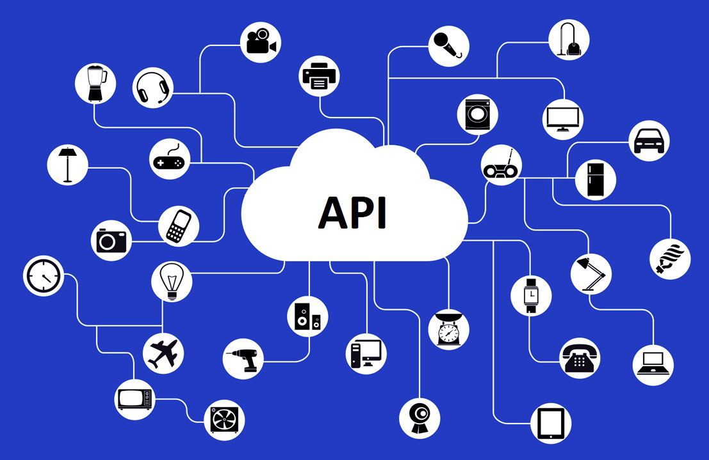

### Como diseñar y como no diseñar APIs

Diseñar APIs es un arte. Las buenas APIs no son solo hermosas, sino que ahorran tiempo a todos. Crear una API con la que los usuarios se queden encantados de interactuar depende de nosotros, los desarrolladores.

Si bien cada desarrollador o equipo de desarrollo tiene sus propias reglas, todos podemos beneficiarnos sabiendo que no debemos hacer y que si tenemos que hacer. Los principios pueden ser abstractos y su manera de implementar puede ser adoptada de manera diferente, pero deben guiar las decisiones técnicas.

### Consistencia

La congruencia significa que todos los endpoints de tu API deben comportarse de forma similar. Debemos esforzarnos en mantener una terminología, estructura de las URLs, los formatos de los request/response y los mensajes de error tienen que ser consistentes en toda la API.

**Si**

    /usuarios
    /usuarios/pedro

**No**

    /obtener_usuario_todos
    /obtener_pedro

La consistencia es uno de los puntos mas importantes que podemos implementar en tu API. Si solo haces esto ya hablaran bien de vos.

### Documentación

Si tenés la consistencia ya tenes muchos puntos ganados, pero los usuarios necesitarán un lugar donde puedan obtener detalles de aspectos y capacidades de la API.

En la documentación de la API, además de presentar plantillas de requests y responses, es recomendable incluir cualquier información útil adicional como por ejemplo si los endpoints necesitan el usuario para completar la petición.

Es necesario que la documentación esta actualizada. Se puede lograr con un flujo de trabajo que integre la documentación con el desarrollo. Una buena practica podría ser empezar a desarrollar las apis a partir de [ramls](https://raml.org/) o utilizar herramientas como [Swagger](https://swagger.io/).

Que un desarrollador escriba documentación puede parecerte una pérdida de tiempo, pero cuanto más tiempo le dediques a documentar, menos tiempo vas a perder en responder preguntas e investigar issues sobre errores falsos.

**Si**

Debe ser un placer consultarla. Esta destinada para que personas puedan leerla.

Usar herramientas de creación de documentación de APIs. Un simple archivo [markdown](https://es.wikipedia.org/wiki/Markdown) es mejor que nada.

**No**

Lo peor que podes hacer es documentar una API en una hoja de calculo. El problema es la legibilidad y la sensación en general al consultarla.

### Rendimiento

El rendimiento es complicado con las APIs. Comúnmente las APIs no son consumidas directamente por los clientes finales sino que son utilizadas a través de una aplicación web u otra API de servidor a servidor. Esto hace que sea fácil echarle la culpa a un componente externo o simplemente pasen desapercibidos.

**Si**

Es recomendable no optimizar tempranamente, ya que atrasaras tus MVPs. Debemos optimizar en función de los datos y no del instinto.

**No**

Esto no quiere decir que las peticiones puedan tardar un segundo en completarse. Con aplicaciones modernas, estas demoras no son aceptables.

### Simplicidad

Una de las mejores cosas que tenemos que tener en mente al desarrollar una API es que sea lo mas simple posible, sobre herramientas y estándares aceptados en el globo. No hay necesidad de schemas, API gateways o cualquier otra solución a menos que tengas buenas razones para usarlas.

El dicho “menos es mas” aplica muy bien en esto. Básico y bien. La simplicidad significa menos gastos generales para las personas y máquinas. Menor margen de error.

**Si**

“Menos es más”. Mirá un ejemplo de una carga a una tarjeta de crédito con la api de [Stripe](https://stripe.com/docs/api).

    curl https://api.stripe.com/v1/charges \
    -u api_key: \
    -d amount=2000 \
    -d currency=usd \
    -d source=tok_visa \
    -d description=”Charge for jenny.rosen@example.com”

Hermoso… Cuantos de ustedes estuvieron 30 minutos para entender cómo hacer un pago con la API de famosa tarjeta de crédito?

**No**

Servicio de estado de cuenta de la API de famosa tarjeta de crédito. Se llama GetAccountStatus y es un POST (¿No es irónico?).

    https://api.visa.com/vpa/v1/accountManagement/GetAccountStatus
    Header: Authorization: {base64 encoded userid:password}
    Body: {
        "messageId": “2019–08–29T18:51:44.000Z”,
        "clientId": "B2BWS_1_1_9999",
        "buyerId": 9999,
        "supplierId": "TestSupplierTen",
        "accountRequestId": 1203780061142
    }

Esto es solo para consultar un estado… te aseguro que no querés ver como es un pago.

### Evolución

Es necesario tener una API que cambie de una manera que sea manejable por los usuarios y/o sistemas.

Las aplicaciones webs evolucionan muy rápidamente y cambian constantemente. Las APIs se deben ajustar a lo que necesita la web. Las buenas practicas de diseño aseguran que el UX nunca sea interrumpido por actualizaciones.

La Api se debe versionar desde el minuto cero. Da igual la técnica que utilices para versionar tu API, pero es importante que lo hagas. De esta manera, podrás cambiar la especificación de tu Api sin enojar a nadie.

Podes utilizar métricas para tomar decisiones sobre tu API. Vas a obtener respuestas a preguntas como: ¿Con qué frecuencia se usa mi API? ¿Qué usuarios utilizaron un endpoint de mi API en los últimos 3 meses?. Es más, deberías asegurarte de responder a este tipo de preguntas, ya que te permitirán evolucionar tu API sin fastidiar a tus usuarios.

**Si**

    https://ejemplo.com/v1/usuario
    -
    https://ejemplo.com/v2/usuario

**No**

Si no querés que te ardan las orejas cada vez que cambies tu API, no saques APIs productivas sin versionar.

### Depende de vos

Pensemos en los desarrolladores que van a implementar nuestra API antes de sacarla. Asegurémonos de que la documentación está completa, clara y bien formateada. Comprobemos que los nombres de los recursos siguen las convenciones, que los datos están bien estructurados, son fáciles de entender y usar. Además, prestemos atención a la seguridad y el rendimiento, no olvidemos que al responder errores, tienen que ser semejantes con toda la API.

¿Tenes algún otro principio que aplique al diseñar APIs? ¿O has visto ejemplos de API muy bien diseñadas? Contactame a través de Medium o de [GitHub](https://github.com/ktufernando).