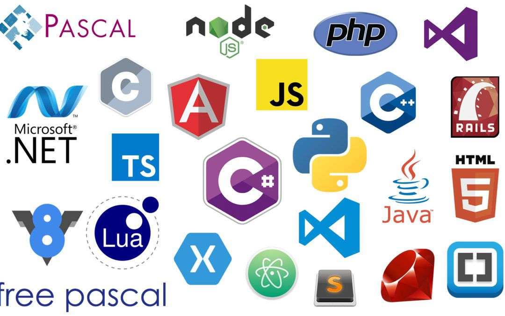

### Como saber elegir el lenguaje y los frameworks apropiados para tus nuevas apps o servicios.

Cuando comienza un nuevo proyecto (aplicación y/o servicio), se deben tomar muchas decisiones. Uno de los temas más importantes es saber elegir el lenguaje de programación y los frameworks. Si sos una de las personas que decide esto dentro de tu empresa, equipo o grupo te va a venir bien leer estos consejos. Si no sos la persona que tomas estas decisiones pero querés en algún momento tener voz para poder hacerlo, tenés que leer este artículo.

Elegir bien puede repercutir y diferenciarse entre un proyecto que marche sobre ruedas y uno que tenga que refactorizar para comenzar desde cero.

Los lenguajes y los frameworks van unidos, para simplificar, voy a hablar de lenguaje pero me voy a estar refiriendo a los dos.

Comenzamos con los 9 tips que nos harán pasar al siguiente nivel.

### Rendimiento

Debemos tener una idea del stress que sufrirá nuestro software. Ya sea un sitio web o una API, el lenguaje tiene que tener la capacidad de responder a las necesidades que debe tener. No es lo mismo una API para una web masiva con miles de usuarios simultáneos que una API para una web interna de empleados dentro de una empresa.

Tampoco hay que ser extremistas, no es buena la optimización excesiva. No es necesario que sintamos que tenemos que planificar un futuro improbable.

### Librerías

Esperamos del lenguaje que nos ayude a desarrollar y tengamos que invertir la menor cantidad de tiempo y esfuerzo posible.

Por lo general hay mucho desarrollo básico que no queremos hacerlo o queremos perder el menor tiempo posible. Crear código que no brinde un valor comercial no tiene sentido. De hecho todo lo contrario, es una ventaja competitiva tener bloques de código desarrollados y mantenidos por otros.

### Usado y probado

¿El lenguaje es nuevo? ¿Podemos encontrar pruebas de otras compañías más grandes que lo hayan usado durante un tiempo considerable y con una carga mayor que la nuestra?

Si encontramos la empresa, ¿Están satisfechos con los resultados?. Busquemos en Internet empleados de la empresa hablando o escribiendo sobre su experiencia.

### Mantenimiento

Al principio como en cualquier relación, el código de cualquier lenguaje parece muy limpio y fácil de crecer. Pero esto suele ponerse feo bastante rápido. El lenguaje y los frameworks que elijamos tienen que ayudarnos a tener un código fácil de mantener y crecer.

Esta muy bueno cuando tenemos código que cualquiera pueda modificarlo y agregar código fácilmente ya que ayudará mucho en el camino del proyecto.

### Comunidad

Cualquiera sea el nivel que tengamos con el lenguaje que elijamos, siempre va a llegar el momento en que tengamos que googlear algo buscando la solución a un problema específico. En ese momento entra en juego tener una comunidad alrededor del lenguaje.

No tener a nadie que nos pueda ayudar no lo recomiendo para nada.

### Habilidades disponibles en el equipo

Si el proyecto comienza con un grupo de personas ya definido, es posible que ya haya experiencia en algún lenguaje. Tiene sentido elegir uno en el que todos ya tengan fluidez y se ajuste a nuestra situación.

Si utilizamos un lenguaje que no conoce nadie, tenemos que tener en cuenta que habrá un costo al principio hasta que todos lo dominen mínimamente. Además que no todos los lenguajes tienen la misma curva de aprendizaje.

### FullStack

Hoy en día se escucha mucho este término y tiene sentido tenerlo en cuenta. Nuestras piezas de software pueden ser desarrolladas en varios lenguajes. Si existe la posibilidad de tener el mismo lenguaje para las diferentes partes de la solución, permitirá a los desarrolladores especializarse en un lenguaje.

Además reduciremos el costo de cambiar de contextos y tener que ser competentes en varios lenguajes.

### Fácil de contratar

Es normal que a medida que pasa el tiempo en el proyecto, la gente se vaya y cambie de trabajo. Entonces surge la necesidad de incorporar nuevos desarrolladores.

Si nuestro proyecto es desarrollado en un lenguaje convencional o con popularidad, será más fácil encontrar nuevas personas que puedan participar.

Si elegimos un lenguaje de características contrarias ¿Que pasaría si se van demasiadas personas?

### Simplicidad y tiempo de comercialización

Si bien algunos lenguajes pueden ser divertidos de codear, debemos considerar todas las cualidades juntas, pero ninguna de estas importará sino podemos tener un producto terminado en manos del cliente cuando lo necesita.

***

No hay una manera fácil de seleccionar un lenguaje y saber cual de estos puntos es el más importante para nuestro proyecto. Solo nosotros y nuestro equipo podemos reflexionar la mejor solución en cada caso.

Es posible que tengamos que hacer compensaciones porque es poco probable que podamos tener en cuenta todos los tips con total confianza. Lo que elijamos, tiene que tener como objetivo; asegurarnos que tenga sentido para nosotros.

