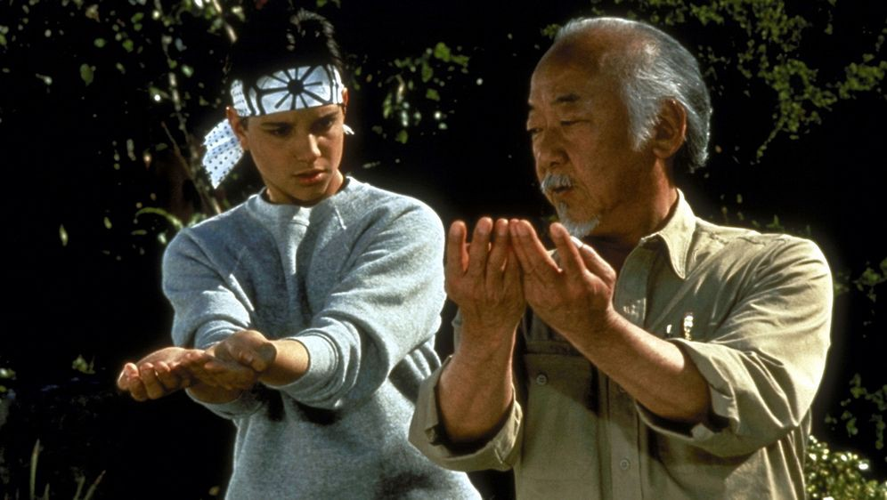

### Lo que tenés que saber para recorrer tú camino y convertirte en un desarrollador destacado.

Para ser un desarrollador senior realmente bueno solo hay que seguir la siguiente secuencia:

    1. Cometer error
    
    2. Corregir error
    
    3. Aprender del error
    
    4. Compartir el error
    
    Repetir

Esto seguramente ya lo sabés. Lo que te puedo decir es que; es simple de entender pero no necesariamente sea fácil de aplicar.

> En la escuela no nos enseñan en cómo mejorar, destacar o dar más valor. Por esto te traigo este artículo para que puedas desarrollarte, crecer y obtener más y mejores resultados en tu VIDA como developer.

Una colección de errores se convierte en tu experiencia y aprender de la experiencia es la clave para convertirte en un desarrollador senior exitoso. Simple, ¿verdad?

Entonces, si recientemente comenzaste tu carrera como desarrollador, quizá te preguntes qué pasos tengo que seguir para ascender en la escala profesional. ¿Es simplemente cuestión de tiempo? ¿Tengo que empezar o volver a la facultad y obtener una certificación avanzada? ¿Tengo que hacer cursos, cuales hago?

*No necesariamente.*

A pesar de que la educación formal puede ayudarte, conozco a muchos desarrolladores que han alcanzado el estatus de senior sin un título universitario. De hecho el mejor de los que conozco no lo tiene.

Cuando me refiero a los grandes desarrolladores senior, me refiero a que no solo pueden escribir código sólido sino que también tienen otros rasgos que los hacen sobresalir. Un desarrollador senior es una persona que puede aportar 10 veces más valor a empresas, proyectos o productos. Estos son desarrolladores que saben cómo funcionan las “cosas” y pueden ofrecer valor al cliente.

Lo que te quiero transmitir es que pienses en más que un título de trabajo. En una ética de trabajo. No es lo que haces, sino cómo lo haces, lo que te llevará al éxito de un verdadero desarrollador senior. Y no hay forma de evitar esto. Te puedo asegurar que viene con errores, muchos errores, que finalmente se convierten en aprendizaje y experiencia.

Te voy a mencionar algunas cualidades que te convertirán en un gran desarrollador senior, y que se distinguen de aquellas personas que aún no lo son.

### Son Curiosos

Los buenos desarrolladores usan la curiosidad de manera estructurada para poder usar la información acumulada durante situaciones de urgencia o presión. Una de las formas de hacerlo es profundizar en cualquier lenguaje de programación antes de ampliar.

Un porcentaje muy reducido de empresas crean soluciones técnicas que muchos equipos anteriores no lo hicieron antes. Los problemas comunes de programación son clásicos.

Esta es la razón por la cual la mayoría de cosas que se intentan hacer en el día a día ya están resueltas por el mismo lenguaje o plataforma que ya estas usando. En este contexto se puede agregar valor aprendiendo las bases de su lenguaje antes de aprender uno de sus frameworks.

Los buenos desarrolladores nunca aceptan las cosas como son. Puede o no funcionar el codigo pero siempre están tratando de encontrar respuestas, como niños preguntando “por qué”.

### Admiten lo que no saben

¿Como manejarías el momento cuando ocurra lo inevitable de que no sepas del tema?

Estuviste hablando durante 15 minutos sobre tus logros con confianza. Respondiste sí, sí y sí de nuevo a una pregunta tras otra, pero ahora te están preguntando sobre cosas que … bueno, realmente no sabés.

Esto es doloroso para muchos. Pero, está perfectamente bien decir que no sabés. Es mucho mejor que ocultar tu falta de conocimiento o habilidades. La clave es saber cómo abordar el problema, ya sea preguntando a alguien más o profundizando.

Se trata de cómo respondes la pregunta lo que te hace mas grande. ¿Podés entender por qué lo están preguntando para tener más contexto y ser más útil? ¿Podés ofrecer ayuda para encontrar la respuesta con ellos? ¿Vas a hacer un poco de investigación y seguimiento?

Ser desarrollador senior no significa que tengas que saberlo todo. Significa que podés ayudar a descubrir y resolver cualquier cosa.

### Son Mentores

La expectativa clave de los desarrolladores senior es que deberían poder interactuar muy bien con clientes y/o partes interesadas internas y externas.

Durante mi carrera he tenido arquitectos que hablaban con una jerga que pocos podían seguirlo, solo les interesaba demostrar que sabían pero no podían compartirlo. La jerga tecnológica no te llevará a ninguna parte cuando interactúes con personas de entornos no técnicos. Es por eso que los mejores desarrolladores senior son los que no se dejan impresionar por la tecnología.

Vos podrías cultivar la habilidad de explicar conceptos técnicos complejos en un lenguaje simple, utilizando ejemplos de la vida real y midiendo rápidamente el nivel de comodidad que tiene la persona que te está escuchando.

La tutoría es el poderoso vínculo entre un joven y alguien con más experiencia no solo para el desarrollo profesional sino también para el crecimiento personal. Compartir conocimiento, compartir experiencias, hacer crecer a los demás y seguir adelante es primordial.

### Detectan el código incorrecto

Existe el problema que no se puede saber lo que hizo un programador hasta que es demasiado tarde.

Es por esto que los buenos desarrolladores senior pueden anticipar, detectar, “oler” el código incorrecto. Si parece que es código malo y huele a código malo, seguramente sea un código malo.

Los desarrolladores pueden cometer errores, vos podes cometer errores, así funciona la codificación. El problema es cuando se copian esos errores.

Cuando construimos soluciones iterativamente sobre desarrollos anteriores, debemos esforzarnos por mejorar la base del código y no seguir haciéndolo mal o peor aún, empeorarlo.

Entonces cuando te salga la pregunta, la pregunta más recurrente en el desarrollo; ¿Quién *&@#€[~$% escribió esto?, inevitablemente te tiene que salir ¿Qué puedo hacer para mejorarlo?

También necesitás saber qué tenemos que mejorar antes de poder descubrir cómo mejorarlo. Aprendamos cómo se ven los códigos buenos y malos. Los mejores entrenadores de fútbol pasan mucho tiempo estudiando a los mejores equipos y no de equipos promedio. Estoy seguro de que lo mismo aplica al desarrollo.

***

Muchas cosas de las que leíste en este artículo ya las sabés. La mayoría de este conocimiento que te compartí ya lo sabés. Sabemos lo que tenemos que hacer, sabemos lo que tenemos que evitar, todo esto ya lo sabés. El único problema es que no lo ponemos en práctica, por esto es que necesito que te comprometas conmigo, en que si una de las ideas que mencioné resuena en vos, te interesa ponerla en práctica, que te comprometas a que vas a empezar hoy mismo con el paso más pequeño posible, el gesto más mínimo a hacerlo.

Solo pensar en poner en práctica no sirve, tenes que ponerte en práctica para tu crecimiento exponencial.

Te voy a dar el ingrediente secreto… El ingrediente secreto es la actitud, es Tú actitud. Si vivís tu día a día sin ganas con tu colegas, ellos lo van a notar. Entonces salí de tu casa con ganas, salí con actitud a vivir el día. No esperes a mañana. Ya sabes lo que tenes que hacer y sabes que lo podes hacer. No dejes pasar el tiempo, vive el tiempo. Pensá que cada minuto que des un paso al éxito, la mayoría de las personas están perdiendo tiempo con su celular. Es muy fácil diferenciarse pero tenes que empezar a actuar ya.