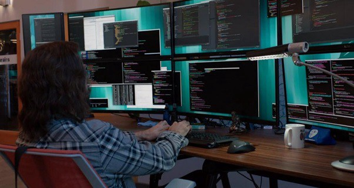

Muchos artículos toman el papel de los líderes tecnológicos y los gerentes de ingeniería. Un tema común que encuentro seguido es cómo aumentar la productividad de un equipo. Pero antes de concentrar la energía tratando de aumentar la productividad, quizás primero deseen considerar lo que la está destruyendo. Y con esto tener una base sólida sobre la cual se pueda construir.

Voy a enumerar una lista de cosas, que creo, siento, pienso por propia experiencia, evitan que los desarrolladores entren “en lag” y sean productivos. Voy a amar una lista de mayor a menor importancia. ¡No dudes en comentar!

Si te preguntas si todo esto vale la inversión, solo tené en cuenta los salarios de los desarrolladores. ¡Incluso un 10% más de productividad es MUCHO!

> Si bien hoy en día mi función no es la de un desarrollador, cada vez que hable de desarrolladores, me voy a incluir porque todavía me siento desarrollador.

### Interrupciones y reuniones

Las interrupciones son, en mi opinión, las principales causas de pérdida de productividad para los desarrolladores. Los desarrolladores no podemos volver con facilidad a donde estábamos antes de una interrupción. Necesitamos entrar en una mentalidad o conectarnos con el desarrollo y luego rastrear lentamente hasta donde lo dejamos. Esto puede llevar como 30 minutos. Y cuantas más interrupciones, más frustraciones, menos trabajo de calidad, más errores.

¿Y las reuniones? La única diferencia entre una reunión y una interrupción es que una reunión es una interrupción planificada, ¡lo que la hace peor!. Los desarrolladores no podemos avanzar en una tarea si sabemos que tendremos una interrupción mientras trabajamos en ella. Entonces, si tenemos una reunión en una hora, no podremos progresar en nada, ya que la mayoría de las tareas de ingeniería toman más tiempo.

¿Cómo se puede evitar? Hay mucha documentación sobre este tema. Mantener reuniones breves sobre el estado al comienzo del día o justo antes del almuerzo, por ejemplo, para evitar interrupciones innecesarias.

### Imprecisión

Los informes de bugs como “¡Está roto, arreglar!” No tienen suficiente información para que los desarrolladores podamos trabajar.

O especificación poco clara sobre una característica, en cuyo caso los desarrolladores comenzaremos a implementar lo que nos parezca correcto, antes de que tengamos que comenzar de nuevo desde cero una vez que el gerente, dueño del producto o quien sea detalle mejor el comportamiento esperado.

La priorización poco clara también pertenece a esta categoría. El tiempo en que los desarrolladores pasamos preguntándonos si estamos trabajando en la tarea correcta puede evitarse fácilmente. A qué desarrollador no le ha pasado alguna vez, recibir un comentario del gerente preguntando; ¿por qué trabajaste en esta tarea en particular? (aunque las prioridades no estaban definidas) … bueno, como decirlo, mucha frustración …

### Avaricia de crédito

¿Alguna vez tuviste un gerente u otro desarrollador que tomó todo el crédito por el trabajo que realizaste en las últimas semanas? Los desarrolladores valoramos la capacidad sobre todo. Tomar el crédito de otra persona es tomar la capacidad del otro para vos y quitársela de él o ella. Esto es importante en mi lista, ya que siento que crea tanta tensión que solo destruye la productividad de los desarrolladores durante bastante tiempo.

### Ambiente — Ruidos, movimiento, diseño del espacio de trabajo

Esto puede parecer extraño para los NO programadores, pero el entorno en el que trabajamos los desarrolladores tiene un impacto importante en nuestras actividades. Por ejemplo, tener un poco de ruido (calle ruidosa, escuchar autos y camiones pasar) nos ayuda a concentrarnos mejor. ¡Es por eso que muchos de nosotros nos ponemos auriculares!

Mirá la web [RainyMood](https://rainymood.com/), ¡realmente genial!

Del mismo modo, si el espacio de trabajo está diseñado para tener mucho movimiento, ¡eso no nos ayudará a concentrarnos! O tener las pantallas de las computadoras de escritorio orientadas de tal manera que sean muy visibles para los gerentes … bueno, eso crea un poco de estrés adicional e incluso más oportunidades para ser interrumpidos.

### Cambios de alcance

Los cambios de alcance en la gestión de proyectos se refiere a cambios incontrolados en el alcance de un proyecto. Esto puede ocurrir cuando el alcance de un proyecto no se define, documenta o controla adecuadamente.

¡El cambio de scope convierte solicitudes relativamente simples en monstruos terriblemente complejos y que consumen mucho tiempo! ¡Y la mayoría de las veces sucede durante el desarrollo! Por ejemplo, para una característica simple:

Versión 1 (antes de la implementación): la característica es “Mostrar la ubicación en un mapa”

Versión 2 (cuando la versión 1 está casi terminada): la función se cambia a “Mostrar la ubicación en un mapa 3D”

Versión 3 (cuando la versión 2 está casi terminada): la función volvió a cambiar a “Mostrar la ubicación en un mapa 3D por la que el usuario puede volar”

### Falta de consideración de la deuda técnica

La deuda técnica es una decisión deliberada de no implementar la mejor solución o no escribir el mejor código para lanzar el software más rápido. Asumir algunas deudas técnicas es inevitable y puede aumentar la velocidad en el desarrollo de software a corto plazo. Sin embargo, a la larga, contribuye a la complejidad del sistema, lo que ralentiza a los desarrolladores.

Los no programadores a menudo subestiman la pérdida de productividad y están tentados a seguir adelante, y eso se convierte en un problema.

Pero si la refactorización nunca es parte de las prioridades, no solo afectará la productividad sino también la calidad del producto.

### Multiplicidad de herramientas y hardware

Los desarrolladores usamos muchas herramientas para programar, versionar nuestro código todos los días. Cuanta más automatización, mejor.

No hace falta decir que herramientas “antiguas” afectarán la productividad. Del mismo modo, tener una pantalla grande o solo una laptop puede tener un impacto.

Dado el costo del hardware y el salario del desarrollador, ¡tener solo un 5% de aumento de productividad definitivamente creo que vale la pena cualquier inversión en ese punto! Mi opinión es simplemente proporcionar las herramientas y el hardware que el equipo de desarrolladores prefiere (individualmente para el hardware, pero como grupo para las herramientas).

### Plazo: para ayer

Está relacionado con la tendencia de los gerentes a pedirnos a los desarrolladores presupuestos, luego presionarnos para que reduzcamos esos estimados tanto como sea posible, ¡y luego mágicamente los consideran como plazos!.

Los gerentes incluso consideran que, dado que nosotros mismos “decidimos” sobre la estimación, nos comprometimos con los plazos y, por lo tanto, los plazos deben considerarse lo suficientemente válidos como para compartirlos con la dirección.

No es sorprendente que los desarrolladores citamos que esos plazos no son razonables y son arbitrariamente ajustados; Esto crea tensión e incapacidad para concentrarse.

***

Estos puntos, en realidad, son bastante comunes para la mayoría de los trabajos basados en proyectos. Es solo que el impacto de cada uno de estos es más importante para los desarrolladores, ya que necesitamos un enfoque profundo (o conectarnos) para progresar en nuestras tareas.

Si reconoces alguno de los puntos mencionados dentro de su empresa, resultaría interesante abordarlos con tus desarrolladores. Hablar y empatizar suele tener buenos resultados para resolver los problemas. Lo más importante es confiar en sus comentarios y opiniones.

Aunque la tecnología actual es muy diferente a la de hace 10 años, la lección sigue siendo la misma. No se puede ignorar el factor humano cuando se considera la productividad del equipo.

***

Muchas cosas de las que leíste en este artículo ya las sabés. La mayoría de este conocimiento que te compartí ya lo sabés. Sabemos lo que tenemos que hacer, sabemos lo que tenemos que evitar, todo esto ya lo sabés. El único problema es que no lo ponemos en práctica, por esto es que necesito que te comprometas conmigo, en que si una de las ideas que mencioné resuena en vos, te interesa ponerla en práctica, que te comprometas a que vas a empezar hoy mismo con el paso más pequeño posible, el gesto más mínimo a hacerlo.

Solo pensar en poner en práctica no sirve, tenés que ponerte en práctica para tu crecimiento exponencial.

