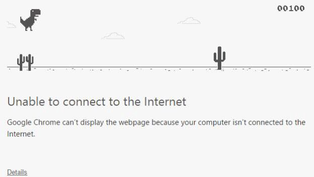
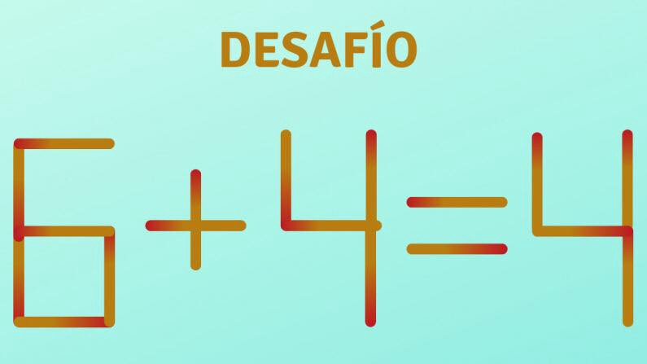

### Contratar al desarrollador adecuado lleva tiempo, preguntas correctas y curiosidad

Sos malo para realizar entrevistas técnicas. Seamos sinceros.

Estás haciendo preguntas irrelevantes, ignorando a los buenos desarrolladores sesgado por tu visión y la de tu empresa.

Hace algunos años en mi empleo anterior, me di cuenta cuando estaba entrevistando a un excelente desarrollador, uno de los mejores que había conocido.

Era el candidato perfecto en todos los aspectos. Le tire granadas, luego misiles. Toda mi artillería la destruyó con confianza y lógica. Para cuando me di cuenta ya no tenia mas municiones, y su armadura estaba intacta.

*“Ok Matías, ya no tengo más preguntas. ¿Podemos cerrar la parte de RRHH rápidamente?”*, dije, apenas capaz de disimular la conjetura de mi cara.

Respondió en voz baja.

*“Fernando, gracias por dedicar tiempo a esta entrevista. Siempre creí que las entrevistas son bidireccionales. La empresa conoce al candidato y el candidato tiene la oportunidad de saber más sobre la empresa. De hecho, una entrevista es la única ventana disponible para cualquier candidato en la que pueda evaluar la cultura de cualquier organización y su adaptación a ella”*.

Me puse incómodo, cambié mi postura en la silla, sin saber a dónde llegaría la conversación.

*“Me gustaría rechazar esta oportunidad, ya que no creo que sea la persona adecuada dentro de la cultura de esta organización. No quiero empezar una relación que sea dolorosa”*. Dijo mirándome directamente a los ojos.

Estaba molesto, enojado. Dolido por el ego.

Esperé a que diera las razones.

***

### “No estoy acá para impresionarte”

Pasas 15 minutos de la entrevista hablando de vos mismo, tu título, responsabilidades y habilidades. Me contás de forma incuestionable que sos la persona más poderosa de tu organización.

Y además, esperas que sea un experto en todo, desde jugar al truco hasta política exterior.

#### ¿Qué es exactamente lo que estás tratando de lograr?

Si estás reclutando un técnico, debes buscar un solucionador de problemas, un activo que pueda unirse a tú equipo y ayudarlo a ser mejor y creativo. Si estás buscando un desarrollador sumiso que simplemente sigue ciegamente lo que decís, entonces yo no soy el indicado para vos.

**Lo que esperaba era una conversación técnica honesta y humilde donde pudiéramos aprender y conocernos. Eso habría sido un gran comienzo para esta relación.**

***

### “No soy un desarrollador en papel”

Me das un papel y me pedís que escriba un código. Esperás que recuerde cada sintaxis minúscula del lenguaje. Cada función dentro de las bibliotecas debería estar incrustada en mi cerebro. Cada error lanzado por el compilador debe parpadear en mi mente y mi código “en papel” debe compilar y funcionar.

*Lamento que no sea el mundo “real” en el que trabaje.*

En el mundo real, se supone que debo usar las herramientas, técnicas y funcionalidades disponibles para resolver los problemas específicos. Un gran desarrollador utiliza los recursos a su disposición y produce código bien elaborado a través de pruebas y refactorización. Si realmente querés probar mis habilidades, dame un sistema y todos los recursos, te puedo mostrar lo que puedo hacer.

**Los desarrolladores son buenos, no por saber los detalles sobre cada lenguaje que hay en el mercado. Son buenos al saber con precisión cómo, dónde y cuándo usar las herramientas que tienen a disposición.**

***

### “Mi camino también puede ser el camino correcto”

¿Te acordás el desacuerdo que tuvimos?

Me puse en el pizarrón y te mostré en detalle la arquitectura que había implementado en mi proyecto anterior. Te expliqué todas las ventajas del enfoque y la simplicidad en el mantenimiento que se ha convertido en un punto de inflexión para las operaciones. También les mencioné los agradecimientos y elogios que recibí de mis clientes que lo usaban.

**¿Y tu reacción?**

*“Algo está mal. He diseñado tantas aplicaciones y esto parece demasiado simple para ser cierto y viable. Esto no se puede usar en el mundo real de manera efectiva”.*

*“Pero, esto está siendo utilizado por miles de usuarios en 3 continentes y hasta el momento no hemos recibido ninguna queja. De hecho, tenemos usuarios muy satisfechos”.*

*“Todavía creo que la forma en que estamos implementando acá es mejor. Está probado y testeado y nada puede ser mejor que eso”.*

No vale la pena seguir la conversación.

El punto es que quiero trabajar en un ambiente de colaboración donde las ideas se discutan, se consensúan y se seleccionan en función del mérito y no con el enfoque de **“esta es la forma en que hacemos las cosas acá”**. Cada organización usa palabras elegantes como colaboración, trabajo de equipo y todo eso, pero pocas organizaciones hacen lo que dicen, y hacen que las cosas sean realmente colaborativas.

**La creatividad necesita colaboración para prosperar, pero hay una línea muy delgada entre la colaboración y la conspiración. La primera es una cultura de “no estar de acuerdo con el acuerdo” que saca lo mejor de las personas, mientras que la segunda es una cultura de “estar de acuerdo sin estar en desacuerdo”, que es una receta para el desastre.**

***

### “Los acertijos son una pérdida de tiempo”

¿Cuántas pelotitas de golf entran en un colectivo?

¿Cuanto pesa un Boing 747?

¿Que ves en esta mancha?

Según algunas almas iluminadas, estos Brainteasers, Mindtraps, ayudan a comprender cómo “piensan” los candidatos, especialmente si se enfrentan a un problema laboral repentino e inesperado.

¿Son buenos en cálculos y estimaciones? ¿Visualización y resolución de problemas? ¿Carecen de ciertas habilidades blandas? ¿Son pensadores lógicos o son más propensos a buscar la forma **“más difícil”** de resolver problemas?

*No creo que esto sirva.*

La capacidad de responder a estos acertijos no tiene nada que ver con qué tan bien el candidato puede pensar en el problema de negocio y escribir un código bien elaborado. Ninguno de estos acertijos dará una idea de si un candidato es bueno trabajando en equipo o tiene habilidades de liderazgo.

**Tales habilidades se encuentran haciendo preguntas de valor relacionadas con su experiencia y comprendiendo situaciones de sus empleos donde demostró su capacidad.**

***

### Últimos pensamientos

Gracias a Matías me di cuenta que estaba mal, pero lo más importante es el aprendizaje que obtuve. Aprendí a respetar a los candidatos y tratarlos como iguales.

Las malas entrevistas son más fáciles de realizar. Requieren menos pensamiento y creatividad de nuestra parte. Pero el resultado final, como todos sabemos, es desastroso.

Dicho esto, no hay reglas para buenas entrevistas, ni claves secretas que puedan aplicarse. Pero la recompensa por esforzarse es una compañía más fuerte, mejores personas, un mejor producto y una vida laboral más feliz para todos en el equipo.

***

Muchas cosas de las que leíste en este artículo ya las sabés. La mayoría de este conocimiento que te compartí ya lo sabés. Sabemos lo que tenemos que hacer, sabemos lo que tenemos que evitar, todo esto ya lo sabés. El único problema es que no lo ponemos en práctica, por esto es que necesito que te comprometas conmigo, en que si una de las ideas que mencioné resuena en vos, te interesa ponerla en práctica, que te comprometas a que vas a empezar hoy mismo con el paso más pequeño posible, el gesto más mínimo a hacerlo.

Solo pensar en poner en práctica no sirve, tenés que ponerte en práctica para tu crecimiento exponencial.

**

Antes de que te vayas…

¿Encontraste interesante el artículo? ¿Te gustaría que escriba sobre algún tema en particular?
Escribime o contactame a través de [Medium](https://medium.com/@ktufernando) o [GitHub](https://github.com/ktufernando) o [LinkedIn](https://www.linkedin.com/in/fervaldes/).