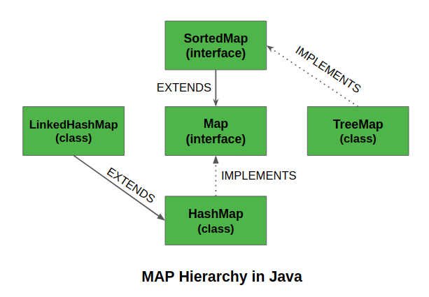
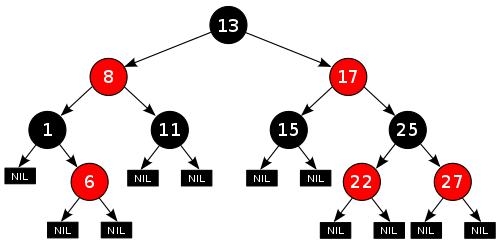
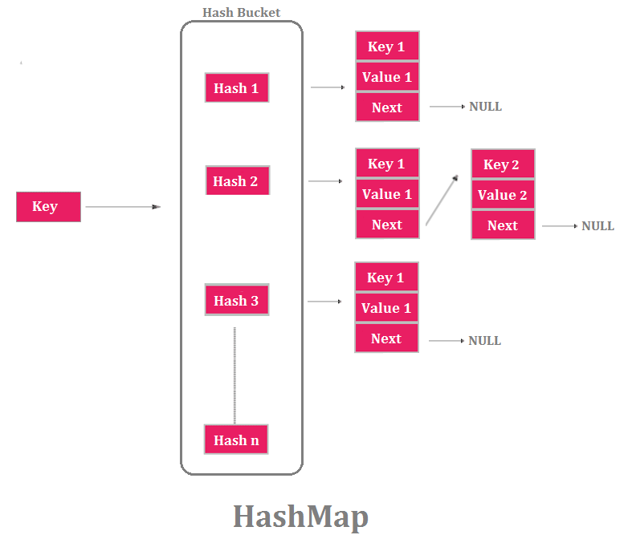

En cualquier problemática que queramos resolver siempre hay diferentes soluciones, y cada una de las opciones puede ser correcta dependiendo del contexto. Este contexto es lo que nos ayudará a determinar cual es preferible utilizar y cuales evitar.

El almacenamiento de pares clave/valor es una tarea común en programación. Quizás tu conocimiento parcial puede llevarte a elegir una estructura de datos que ofrezca el mejor rendimiento en términos de complejidad temporal, pero eso es solo una parte de la ecuación. ¿Necesitamos mantener nuestros datos ordenados? ¿La colección crecerá y disminuirá constantemente? ¿Qué pasa con los valores únicos o las claves duplicadas? En la medida de lo posible, intentaremos pensar en cómo van a interactuar los datos que almacenaremos y vamos a elegir la estructura de datos que mejor se adapte a nuestras necesidades.

Vamos a analizar tres estructuras java de almacenamiento clave/valor para demostrar las diferencias a las respuestas de las preguntas del párrafo anterior: HashMap, Linked HashMap y TreeMap.

### Estructura

Un [TreeMap](https://docs.oracle.com/javase/8/docs/api/java/util/TreeMap.html) es implementado como un árbol Rojo-Negro, un tipo de árbol binario de búsqueda equilibrada. Esto significa que se agrega un bit adicional a cada nodo que etiqueta al nodo como negro o rojo. Estas etiquetas son las que permiten que el árbol se equilibre cuando se agregan o eliminan elementos. Este equilibrio es importante porque el rendimiento está directamente relacionado con la altura del árbol. Un árbol desequilibrado tendrá una altura mayor de la necesaria, lo que comienza a afectar el rendimiento.

Los TreeMaps en Java se ordenan automáticamente. De manera predeterminada, se ordenará según el orden natural de las claves, pero también se puede usar un comparador personalizado para crear los TreeMaps.

Un [HashMap](https://docs.oracle.com/javase/8/docs/api/java/util/HashMap.html), almacena pares clave / valor en una tabla hash, y los elementos no están ordenados de ninguna manera. Rapidamente podemos decir que si el orden es importante para nosotros, elijamos TreeMap en vez de HashMap. Sin embargo, HashMap generalmente ofrece un rendimiento de tiempo constante en operaciones básicas, mientras que TreeMaps garantiza un rendimiento logarítmico para las mismas operaciones.

La tercera estructura, un [LinkedHashMap](https://docs.oracle.com/javase/8/docs/api/java/util/LinkedHashMap.html), agrega una lista vinculada a la estructura del HashMap. Esto significa que obtenemos los beneficios de rendimiento de un HashMap, con ordenamiento (orden en que se insertaron los elementos).

### Rendimiento

Un HashMap tiene ventajas en términos de rendimiento, ya que ofrece un rendimiento de tiempo constante (O(1)) para operaciones como get y put, pero por detrás las cosas son más complicadas, y debemos tener en cuenta cómo podría crecer la estructura a través del tiempo.

Hay dos factores que pueden afectar el rendimiento de un HashMap: carga y capacidad. La capacidad se refiere al número de “buckets” creados por la función hash del HashMap, y la carga se refiere a la amplitud de cada uno de estos buckets. A medida que crezca el número de elementos en la estructura, eventualmente será necesario volver a rehashear para crear más buckets, lo que puede ser una operación costosa dependiendo del número de entradas.

Además, la implementación de HashMap en Java funciona mejor si el factor de carga se mantiene por debajo del 75%. Esto significa que los HashMaps, para mantener el rendimiento, siempre asignarán más memoria de la que realmente se necesita para almacenar las entradas. Por esto, debemos usar HashMaps si se cumple lo siguiente:

1. Queremos un rendimiento de tiempo constante.
2. Tenemos una idea de que grande será la colección.
3. No agregaremos ni eliminaremos una tonelada de elementos regularmente.

Por otro lado, un TreeMap solo puede garantizar un costo de tiempo logarítmico (0(log(n)) para métodos como contains, get o put. Esto se debe a que el rendimiento de un árbol rojo-negro se relaciona directamente con la altura del árbol.

Algo importante a tener en cuenta es que, a cierta escala, el HashMap modifica su estructura de datos interna, transformando los buckets en TreeNodes, en cuyo caso funcionará de manera similar a un TreeMap.

### Conclusiones

Entonces, ¿cuál deberíamos usar? ¡Depende! Al igual que cada decisión en programación, tomar una decisión es considerar los pros y los contras.

|Tipo         |Rendimiento (operaciones basicas)                              |Memoria                                                                                |Ordenamiento          |Valorenes nulos                               |
|-------------|---------------------------------------------------------------| --------------------------------------------------------------------------------------|----------------------|----------------------------------------------|
|Treemap      |Logaritmica                                                    |Solo tanto como sea necesario (no contiguo)                                            |Ordenamiento natural  |Claves: no nulls. Valores: multiples nulls    |
|HashMap      |Tiempo constante                                               |Los tablas necesitan rehashear cuando los buckets estan al 75% (requiere n operaciones)|Sin ordenamiento      |Claves: solo un null. Valores: multiples nulls|
|LinkedHashMap|Tiempo constante (potencialmente un poco más lento que HashMap)|Igual que HashMap                                                                      |Por orden de inserción|Claves: solo un null. Valores: multiples nulls|

Entonces te recomiendo usar un TreeMap si no tenés idea de cuántos elementos vas a tener en tu colección (y podría ser una colección grande) y podes asumir el tiempo de log(n) más lento. Usar un HashMap si querés tener una complejidad de tiempo constante realmente rápida y sabes que el tamaño general de la colección no variará significativamente (y no será demasiado grande). Usar un LinkedHashMap si un HashMap va bien con sus restricciones y querés tener la ventaja adicional de ordenar.

¡Feliz mapeo!

***

Muchas cosas de las que leíste en este artículo ya las sabés. La mayoría de este conocimiento que te compartí ya lo sabés. Sabemos lo que tenemos que hacer, sabemos lo que tenemos que evitar, todo esto ya lo sabemos. El único problema es que no lo ponemos en práctica, por esto es que necesito que te comprometas conmigo, en que si una de las ideas que mencioné resuena en vos, te interesa ponerla en práctica, que te comprometas a que vas a empezar hoy mismo con el paso más pequeño posible, el gesto más mínimo a hacerlo.

Solo pensar en poner en práctica no sirve, tenés que ponerte en práctica para tu crecimiento exponencial.

***

Antes de que te vayas…

¿Encontraste interesante el artículo? ¿Te gustaría que escriba sobre algún tema en particular?
Escribime o contactame a través de [Medium](https://medium.com/@ktufernando) o [GitHub](https://github.com/ktufernando) o [LinkedIn](https://www.linkedin.com/in/fervaldes/).