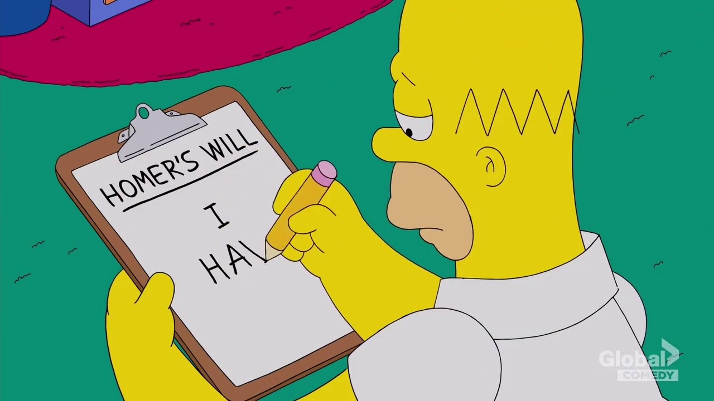

## A veces, irse es el mejor movimiento que nos queda.

En muy poco tiempo se fueron dos personas que las considero muy valiosas. Esto me lleva a reflexionar porque decidimos cambiar de puesto y cual es el mejor momento para hacerlo.

Estuviste en la empresa durante tres, cuatro o incluso cinco años y no fuiste promovido. Querés mucho a las personas con las que trabajas, pero no estás contento con tu compensación.

Te estás preguntando si ahora es el momento de partir. Necesita saber si irte es el movimiento correcto.

Antes de responder esta pregunta, te voy a hacer algunas otras.

Cuando comenzaste el empleo, ¿tenías un plan u objetivos específicos en mente? En caso afirmativo, ¿ejecutaste ese plan lo mejor que pudiste? ¿Cuál es tu razonamiento para irte? La mayoría de nosotros informamos a un gerente, ¿planteaste tus preocupaciones con tu gerente?

### Plan de crecimiento

Cuando comienzo una nueva posición, siempre trato de tener un plan de crecimiento. Por lo general, implica cómo llegar al siguiente nivel de la manera más rápida humanamente posible.

Tener un plan de juego me ayuda a idear un cronograma razonable para lograr mis objetivos.

Sé que esto varía en cada persona. La idea es determinar qué es importante para vos y qué tan agresivo querés ser con tu vida. Establece objetivos específicos para puntos específicos en tu vida, luego anda a trabajar.

Digamos que, cuando comenzaste tu puesto actual, tu título de trabajo era desarrollador junior, ¿tenías un plan sobre cómo llegar a ser desarrollador senior? ¿Hablaste con un compañero/amigo, que ya está en ese puesto objetivo, sobre las formas de alcanzar tus objetivos? ¿buscaste nuevas oportunidades? Haber hecho estas cosas te hubiera dado más visibilidad. En otras palabras, las personas que importaban te habrían conocido a ti y a tu contribución.

### Sueldo

¿Estás pensando en irte por tu sueldo? Aprendí a valorar el aprendizaje más que el sueldo.

Al comienzo de mi carrera, estaba ansioso por ganar dinero y no había nada de malo en eso. Todavía no hay nada de malo en eso.

Tomé la primera posición que me ofrecieron porque no había nada mejor. Pensé que si pagaba suficiente dinero, entonces era la elección correcta para mí. No aprendí tanto como quería durante mi tiempo ahí. Tuve que hacer mucho autoaprendizaje.

### Aprendizaje

Disfruté aprendiendo solo porque podía elegir aprender lo que me interesaba, pero apoyarse en el trabajo siempre es más práctico porque te ves obligado a aplicar lo que aprendiste.

También me di cuenta de que las empresas que pagan un valor de mercado o superior generalmente requieren más habilidades. Pensé que si seguía aprendiendo y mejoraba mis habilidades, eventualmente vendría más dinero.

Hoy en día, al menos en la industria de la tecnología, los empleados tienen cierta influencia en cuanto a elegir para qué empresa trabajar.

### Diferentes ofertas

Tuve dos ofertas la primera vez que cambié de trabajo. El primero pagaba más dinero y la compensación general era buena, pero sabía que no iba a aprender mucho ahí.

El segundo pagaba menos, los beneficios no eran tan buenos, pero fue aún más atractivo para mí porque las tecnologías que utilizaban se alineó más con lo que quería aprender.

Entonces, decidí ir con el que pagaba menos y sabía que llegaría a aprender más. Pensé que mi valor aumentaría eventualmente, entonces podría ganar más y convertirme en un ingeniero más hábil.

Entonces, si el dinero es lo más importante para vos en tu posición actual y no recibiste un aumento por un largo tiempo, entonces sí, podría ser el momento de comenzar a buscar mejores oportunidades en otro lugar.

### Respuesta

Ahora esta es mi respuesta a la pregunta. Algunos lugares no te pagarán lo que vales porque adquiriste parte del conocimiento de ellos.

Es posible que veas nuevas oportunidades para hacer el trabajo para el que estás más que calificado.

Si alguna vez te dicen que sos tan valioso en tu posición actual que no pueden permitirse el lujo de trasladarte a otro lugar, entonces sí, es hora de buscar empleo en otro lugar.

### Consideraciones

No todos compartirán mi opinión, pero si estás trabajando en un lugar donde te sentís estancado debido a la falta de oportunidades para avanzar a pesar de todos tus esfuerzos, entonces sí, es hora de que te vayas.

Si tus esfuerzos y contribuciones no son valoradas, entonces sí, podría ser hora de que te vayas.

Si planteaste inquietudes válidas muchas veces y te dijeron que lo tomarían en consideración, y todavía no viste ningún cambio después de meses o incluso años, entonces sí, podría ser el momento de irte.

Tiempo

Por lo general, estoy entre uno a dos años como máximo antes de dejar un puesto si me enfrento a alguno de los escenarios que mencioné anteriormente.

Por mucho que queramos, a veces simplemente no somos nosotros los que provocamos cambios en el lugar de trabajo. Quizás dejar a tu empleador actual es lo necesario para desencadenar un cambio.

Usá tu mejor criterio y hacé el movimiento que sea mejor para vos. Asegurate de estar satisfecho con cualquier decisión que tomes. Porque sólo podés avanzar desde ahí.

***

Muchas cosas de las que leíste en este artículo ya las sabés. La mayoría de este conocimiento que te compartí ya lo sabés. Sabemos lo que tenemos que hacer, sabemos lo que tenemos que evitar, todo esto ya lo sabemos. El único problema es que no lo ponemos en práctica, por esto es que necesito que te comprometas conmigo, en que si una de las ideas que mencioné resuena en vos, te interesa ponerla en práctica, que te comprometas a que vas a empezar hoy mismo con el paso más pequeño posible, el gesto más mínimo a hacerlo.

Solo pensar en poner en práctica no sirve, tenés que ponerte en práctica para tu crecimiento exponencial.

***

Antes de que te vayas…

¿Encontraste interesante el artículo? ¿Te gustaría que escriba sobre algún tema en particular?
Escribime o contactame a través de [Medium](https://medium.com/@ktufernando) o [GitHub](https://github.com/ktufernando) o [LinkedIn](https://www.linkedin.com/in/fervaldes/).