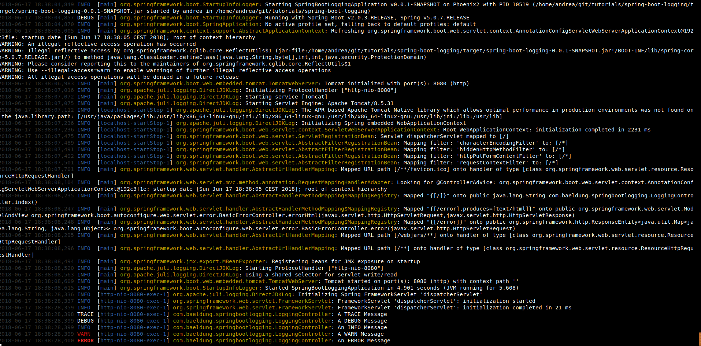

Un buen mecanismo de logs nos va a ayudar en los momentos más críticos.

Cuando queremos resolver una falla en producción o tratamos de entender una respuesta inesperada, los logs pueden ser nuestro mejor amigo o nuestro peor enemigo.

Nuestra capacidad de solucionar fallas productivas depende de darle una enorme importancia a los registros de logs. Cuando se trata de nuestro trabajo diario, cuando diseñamos nuestro nuevo servicio en producción, a veces pasamos por alto su importancia. Nos negamos a prestarles la debida atención.

Cuando comencé a desarrollar, cometí algunos errores de logging que me costaron algunas noches sin dormir. Ahora, que se un poco más, puedo compartir con ustedes algunas prácticas que aprendí a lo largo de los años.

### Elige… estoy seguro de que perderás.

Nuestros servicios en producción generalmente se extiende a través de múltiples máquinas o contenedores. La búsqueda de una entrada de log específica va a requerir investigarlas todas. Cuando no tenemos tiempo (casi siempre), en arreglar nuestro servicio, no podemos perderlo tratando de averiguar dónde ocurrió exactamente el error.

En lugar de guardar los logs en el disco local, debemos **transmitirlos a un sistema de registro centralizado.** Esto nos permite buscarlos todos al mismo tiempo.

Si usamos AWS o GCP, podemos usar su agente de logging. El agente se encargará de stremear los logs a su motor de búsqueda de logs.

### ¿Log o no log?

Hay una línea delgada entre muy pocos y demasiados logs. En mi opinión, las entradas de logs deben ser significativas y sólo deben servir para investigar problemas en nuestro entorno de producción. Cuando estés a punto de agregar una nueva entrada de log, tenes que pensar en cómo la vas a usar en el futuro. Intenta responder a esta pregunta: **¿Qué información proporcionará el mensaje de log al desarrollador que lo va a leer?**

Demasiadas veces veo logs que se utilizan para el análisis de usuarios. Sí, es mucho más fácil escribir "usuario pepe 1234 ha hecho clic en el botón" en una entrada de log que desarrollar una infraestructura de eventos. Esto no es para lo que están destinados los logs (y analizar las entradas de logs tampoco es divertido, por lo que extraer información llevará tiempo).

### Vamos a la práctica!

En la siguiente captura de logs vas a ver tres solicitudes que fueron procesadas por un servicio.

    2019–12–25 22:39:07,051 - ejemplo_simple - INFO - ingreso request
    2019–12–25 22:39:07,053 - ejemplo_simple - INFO - ingreso request
    2019–12–25 22:39:07,054 - ejemplo_simple - INFO - termino request
    2019–12–25 22:39:07,056 - ejemplo_simple - INFO - ingreso request
    2019–12–25 22:39:07,057 - ejemplo_simple - INFO - termino request
    2019–12–25 22:39:07,059 - ejemplo_simple - INFO - termino request

¿Cuánto tiempo llevó procesar la segunda solicitud? ¿1 ms, 4 ms o 6 ms?

Como no tenemos información adicional sobre cada entrada de log, no podemos estar seguros de cuál es la respuesta correcta. Tener el id de request en cada entrada de log podría haber reducido el número de respuestas posibles a una. Además, **tener metadatos dentro de cada entrada de log puede ayudarnos a filtrar los registros y centrarnos en las entradas relevantes.**

Agreguemos algunos metadatos a nuestra entrada de log:

    2019–12–25 23:17:09,139 - INFO - ingreso request id 1 - ejemplo_simple
    2019–12–25 23:17:09,141 - INFO - ingreso request id 2 - ejemplo_simple
    2019–12–25 23:17:09,142 - INFO - termino request id 2 - ejemplo_simple
    2019–12–25 23:17:09,143 - INFO - request id 1 estructura invalida - ejemplo_simple
    2019–12–25 23:17:09,144 - INFO - ingreso request 3 - ejemplo_simple
    2019–12–25 23:17:09,145 - INFO - termino request id 1 - ejemplo_simple
    2019–12–25 23:17:09,147 - INFO - termino request id 3 - ejemplo_simple

¿Qué problema tiene esta estructura? Tomate un tiempo para pensarlo antes de seguir leyendo…

Los metadatos se colocaron como parte de la sección de texto libre de la entrada. Por lo tanto, cada desarrollador puede hacer cumplir sus propios estándares y estilo. Esto puede resultar en una búsqueda complicada.

Nuestros metadatos deben definirse como parte de la estructura fija de la entrada.

    2019–12–25 22:45:38,325 - ejemplo_simple - INFO - user/create - req id 1 - ingreso request 
    2019–12–25 22:45:38,328 - ejemplo_simple - INFO - user/login - req id 2 - ingreso request 
    2019–12–25 22:45:38,329 - ejemplo_simple - INFO - user/login - req id 2 - termino request
    2019–12–25 22:45:38,331 - ejemplo_simple - INFO - user/create - req id 3 - ingreso request
    2019–12–25 22:45:38,333 - ejemplo_simple - INFO - user/create - req id 1 - termino request
    2019–12–25 22:45:38,335 - ejemplo_simple - INFO - user/create - req id 3 - termino request

Cada mensaje en el log fue sacado por nuestros metadatos. Como leemos de izquierda a derecha, debemos colocar el mensaje lo más cerca posible del comienzo de la línea. Además, colocar el mensaje al principio "rompe" la estructura de la línea. Esto nos ayuda a identificar el mensaje más rápido.

    2019–12–25 23:10:02,097 - INFO - ingreso request [user/create] [req: 1] - ejemplo_simple
    2019–12–25 23:10:02,099 - INFO - ingreso request [user/login] [req: 2] - ejemplo_simple
    2019–12–25 23:10:02,101 - INFO - termino request [user/login] [req: 2] - ejemplo_simple
    2019–12–25 23:10:02,102 - INFO - ingreso request [user/create] [req: 3] - ejemplo_simple
    2019–12–25 23:10:02,104 - INFO - termino request [user/create [req: 1] - ejemplo_simple
    2019–12–25 23:10:02,107 - INFO - termino request [user/create] [req: 3] - ejemplo_simple

Colocar la marca de tiempo y el nivel de registro antes del mensaje puede ayudarnos a comprender el flujo de eventos. El resto de los metadatos se usa principalmente para el filtrado. En esta etapa ya no es necesario y se puede colocar al final de la línea.

Un error que se registra en INFO se va a perder entre todas las entradas de logs normales. **El uso de todo el rango de niveles de logs (ERROR, DEBUG, etc.) puede reducir significativamente el tiempo de búsqueda.**

    2019–12–25 23:12:39,497 - INFO - ingreso request [user/create] [req: 1] - ejemplo_simple
    2019–12–25 23:12:39,500 - INFO - ingreso request [user/login] [req: 2] - ejemplo_simple
    2019–12–25 23:12:39,502 - INFO - termino request [user/login] [req: 2] - ejemplo_simple
    2019–12–25 23:12:39,504 - ERROR - estructura invalida request [user/login] [req: 1] - ejemplo_simple
    2019–12–25 23:12:39,506 - INFO - ingreso request [user/create] [req: 3] - ejemplo_simple
    2019–12–25 23:12:39,507 - INFO - termino request [user/create [req: 1] - ejemplo_simple
    2019–12–25 23:12:39,509 - INFO - termino request [user/create] [req: 3] - ejemplo_simple

### Análisis de logs

Al buscar entradas de logs en archivos es un proceso largo y frustrante. Por lo general, requiere que procesemos archivos muy grandes y, a veces, incluso que usemos expresiones regulares.

Hoy en día, podemos aprovecharnos de motores de búsqueda muy rápidos como Elastic Search e indexar nuestras entradas de log. El uso del stack ELK también nos va a proporcionar la capacidad de analizar nuestros logs y responder preguntas como:

1. ¿El error está localizado en una máquina/contenedor? ¿U ocurre en todo el entorno?

2. ¿Cuándo comenzó el error? ¿Cuál es la tasa de ocurrencia del error?

En conclusión, en cada nueva característica que desarrolles, pensa en tu vos futuro y en qué entrada de log te va a ayudar y cuál simplemente te va a distraer.

***

Muchas cosas de las que leíste en este artículo ya las sabés. La mayoría de este conocimiento que te compartí ya lo sabés. Sabemos lo que tenemos que hacer, sabemos lo que tenemos que evitar, todo esto ya lo sabemos. El único problema es que no lo ponemos en práctica, por esto es que necesito que te comprometas conmigo, en que si una de las ideas que mencioné resuena en vos, te interesa ponerla en práctica, que te comprometas a que vas a empezar hoy mismo con el paso más pequeño posible, el gesto más mínimo a hacerlo.

Solo pensar en poner en práctica no sirve, tenés que ponerte en práctica para tu crecimiento exponencial.

***

Antes de que te vayas…

¿Encontraste interesante el artículo? ¿Te gustaría que escriba sobre algún tema en particular?
Escribime o contactame a través de [Medium](https://medium.com/@ktufernando) o [GitHub](https://github.com/ktufernando) o [LinkedIn](https://www.linkedin.com/in/fervaldes/).