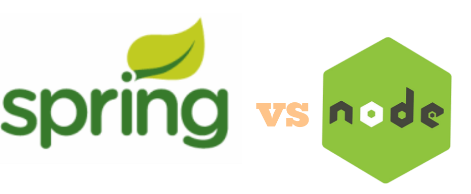

## ¡Fácil! Spring Boot. ¿Si? No tan rápido…

Este es un tema cercano y querido para mí porque trabajo en un lugar donde todo gira en torno a java con [Spring Boot](https://spring.io/projects/spring-boot) cuando se trata de desarrollar aplicaciones web del lado del servidor. Qué Spring Boot esto, que Spring Boot lo otro! ¿No es suficiente Spring Boot? ¿Verdad?

Pero las pruebas que realice en mi tiempo libre me llevó por un camino en el que creo que [Node.js](https://nodejs.org/es/) es la mejor herramienta para usar en el desarrollo web. ¿Es cierto? Vamos a descubrirlo juntos.

***

### Pregunta clave

Responde esta pregunta: *si tuvieras que elegir una tecnología del lado del servidor, Node.js o Java con Spring Boot, para impulsar tu negocio durante los próximos diez años, ¿cuál sería?*

Sé que esta es una pregunta muy amplia, que estamos dejando de lado por ejemplo cuántos usuarios tenemos y qué problema está resolviendo nuestro negocio. Me gustaría que fuera lo más genérico posible. Vamos a suponer que nuestro negocio comienza en la nada y está creciendo a un ritmo exponencial y eventualmente manejando una tonelada de volumen (e inevitablemente será el próximo Google, por supuesto).

Solo vamos a ver Node.js y java con Spring Boot en este artículo. Conozco otras posibilidades como Django, Flask, Ruby on Rails, etc., pero mi experiencia es principalmente en Java y JavaScript, por lo que nos centraremos en estos dos.

Entiendo que una comparación más precisa sería [Express.js](https://expressjs.com/es/) vs. Spring Boot, pero voy a ampliar el alcance y utilizaré Node.js en aras del debate. Aquí está la diferencia para aquellos que no están familiarizados:

Node.js es un entorno de tiempo de ejecución utilizado para ejecutar código JavaScript fuera de un navegador. No es un framework.

Express.js es el framework de aplicación web por defecto para Node.js.

Además, me referiré mucho a Java ya que Spring Boot es un framework basado en Java.

***

### ¿Por qué importa esto?

Es importante comprender las diferencias fundamentales entre estos dos lenguajes / frameworks y lo que los hace especiales, así como las diferentes limitaciones que vienen con cada uno. A medida que avanzamos como desarrolladores web, es esencial que sepamos qué herramientas existen y cómo podemos usarlas para mejorar nuestras propias aplicaciones y negocios.

Vas a ver a continuación las diferentes empresas que han adoptado cada uno de estos frameworks.

#### Node.js

    - Medium
    - Netflix
    - Uber
    - Linkedin
    - Paypal
    - Ebay
    - NASA

### Spring Boot

    - Google
    - Microsoft
    - Accenture
    - Amazon
    - Intuit
    - JPMorgan Chase & Co.
    - Capital One

Esto no quiere decir que Google no use Node.js o que Netflix no use Spring Boot. Estas son compañías que salieron públicamente a decir que usan estas tecnologías.

Vas a notar que hay grandes compañías de tecnología en ambos lados, por lo que esto no nos ayuda a elegir cuál es mejor. Sin embargo, nos muestra que el panorama está cambiando. Java ha dominado gran parte del mundo del desarrollo web en las últimas décadas. Es interesante ver a Node.js / JavaScript establecerse como un jugador legítimo en este espacio.

***

Node.js, desarrollado principalmente en JavaScript, utiliza un modelo de E/S sin bloqueo controlado por eventos y de un solo thread. Esto lo hace increíblemente eficiente y liviano. Perfecto para aplicaciones muy intensivas en datos que necesitan operar en tiempo real en equipos distribuidos.

#### ¿Qué significa eso?

E/S sin bloqueo: este es un concepto muy importante para entender al aprender sobre Node.js. Este sistema permite que un thread trabaje en otra tarea mientras espera que se complete una tarea diferente. En otras palabras, las nuevas tareas no se bloquean mientras se espera que finalicen otras tareas. ¿Cómo logra esto? Node.js se basa en funciones asincrónicas.

El beneficio de esto es que solo se está utilizando un thread y, como resultado, tenemos poca utilización de memoria. Node.js es single-threaded. Además, no tenemos que preocuparnos por los problemas asociados con la administración de múltiples threads, mientras que, en el mundo de Java con Spring Boot, las aplicaciones web están acostumbradas a ejecutar todo en múltiples threads.

***

Implementado en Java, Spring Boot permite un rápido inicio de una aplicación productiva. La idea de Spring Boot es que es muy fácil de ejecutar, por lo que minimiza la cantidad de complicaciones que conlleva la puesta en marcha de una aplicación.

Spring Boot es todo acerca de las dependencias. Se basa en gran medida en anotaciones. Esto simplifica la configuración, que es enorme para cuando un proyecto está creciendo y comienza a tener un montón de dependencias para administrar. Todo está autoconfigurado.

Como mencioné antes, Spring Boot es multi thread. Esto es muy útil cuando se trata de operaciones largas o repetitivas. Cuando se consume el thread principal, otros se usan simultáneamente.

La creación de microservicios también se ha simplificado. La creación de un nuevo conjunto de servicios independientes basados en la nube se puede hacer fácilmente con el conjunto de características proporcionadas por Spring Boot.

***

### Pros y contras

#### Pros

Node.js

    - Comunidad de Javascript: Creciendo rápidamente.

    - Ligero, rápido.

    - Single-threaded: baja utilización de memoria.

    - Genial para tareas de I/O.
    
    - Npm está en constante crecimiento.

Spring Boot:

    - Comunidad Java: madura y próspera.

    - Java es tipado (Chequeo en tiempo de compilación).

    - Soporte y mantenibilidad a largo plazo.

    - Soporte para múltiples threads.

    - Facilidad para usar muchas dependencias.

#### Contras

Node.js:

    - No soporta múltiples threads.

    - La falta de verificación de tipos estricta puede provocar problemas de tiempo de ejecución.

    - No es lo mejor para el cómputo pesado: cuellos de botella en el rendimiento.

    - “Callback hell”: resultado de demasiadas funciones asincrónicas encadenadas.

Spring boot:

    - Alta utilización de memoria.

    - Java is verbose.

    - Gran cantidad de código repetitivo: dificulta el debugging.

    - Puede incluir dependencias no utilizadas: gran tamaño de archivos binarios de despliegue.

### Conclusión

Entonces, para responder a la pregunta: si tuvieras que elegir una tecnología del lado del servidor, Node.js o Spring Boot, para impulsar tu negocio durante los próximos diez años, ¿cuál sería?

Probablemente viniste acá para leer un decisión tomada en lugar del clásico “Depende”. A mi me pasaba cuando leia articulos, quería encontrar una solución directa. Pero ahora entiendo por qué la gente dice que depende. Si estoy creando una aplicación que depende de una tonelada de E/S (FinTech, sistemas de booking, aplicaciones de medios, etc.), usaría Node.js. Pero si necesito que mi aplicación haga una gran cantidad de cómputo (IoT, plataformas de comercio electrónico, Big Data), mejor iría con Spring Boot.

¿El ganador si tengo que elegir solo uno? Node.js. Me encanta la idea de poder construir mi equipo con desarrolladores que puedan trabajar en toda stack. Desde el principio hasta el final, cualquiera puede realizar cualquier tarea en cualquier momento. También siento que JavaScript es más fácil de aprender, por lo que habrá menos curva de aprendizaje al incorporar nuevos miembros al equipo.

Mi principal preocupación con Node.js es la incapacidad de manejar el cómputo pesado. Pero siento que la comunidad Javascript eventualmente llegará y eliminará este problema. Ilusiones? Tal vez. Pero recorrieron un largo camino en muy poco tiempo, y no puedo esperar para ver a dónde llegarán.

***
***

Muchas cosas de las que leíste en este artículo ya las sabés. La mayoría de este conocimiento que te compartí ya lo sabés. Sabemos lo que tenemos que hacer, sabemos lo que tenemos que evitar, todo esto ya lo sabemos. El único problema es que no lo ponemos en práctica, por esto es que necesito que te comprometas conmigo, en que si una de las ideas que mencioné resuena en vos, te interesa ponerla en práctica, que te comprometas a que vas a empezar hoy mismo con el paso más pequeño posible, el gesto más mínimo a hacerlo.

Solo pensar en poner en práctica no sirve, tenés que ponerte en práctica para tu crecimiento exponencial.

***

Antes de que te vayas…

¿Encontraste interesante el artículo? ¿Te gustaría que escriba sobre algún tema en particular?
Escribime o contactame a través de [Medium](https://medium.com/@ktufernando) o [GitHub](https://github.com/ktufernando) o [LinkedIn](https://www.linkedin.com/in/fervaldes/).