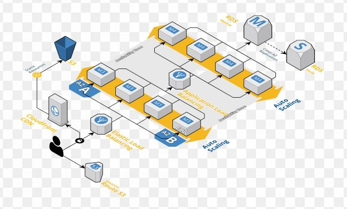

## Ideas generales de arquitectura para tomar las decisiones correctas en tu proyecto.

Decidiste crear tu propia aplicación web, tenés la tarea de definir los lineamientos del próximo proyecto o simplemente tenes la visión de llegar a ser arquitecto. Tenés una idea, pero ahora, es crucial que tengas la arquitectura correcta.

En esta publicación, veremos estas áreas clave:

* ¿Qué es la arquitectura de software?
* ¿Por qué es importante la arquitectura de software?
* La diferencia entre arquitectura de software y diseño de software.
* Patrones de arquitectura de software.
* Cómo decidir la cantidad de niveles que debe tener su aplicación.
* Escalado horizontal o vertical: ¿cuál es el adecuado para tu aplicación?
* ¿Monolito o microservicio?
* ¿Cuándo deberías usar NoSQL o SQL?
* Elegir el lenguaje de programación adecuado para el trabajo.
* Cómo convertirse en un arquitecto de software.

Mi objetivo es brindar una sólida comprensión de la arquitectura web, los conceptos involucrados y cómo elegir la arquitectura y la tecnología correctas cuando diseñas tu aplicación. Al final de este artículo, no vas a estar sin saber por dónde empezar y qué hacer cuando tengas que diseñar una aplicación desde cero.

¡Let’s go!

### ¿Qué es la arquitectura de software?

La arquitectura de software de un sistema describe sus componentes principales, sus relaciones y cómo interactúan entre sí.
Fundamentalmente, sirve como modelo. Proporciona una abstracción para gestionar la complejidad del sistema; establece comunicación y coordinación entre componentes.

#### Algunos puntos claves:

* La arquitectura ayuda a definir una solución para cumplir con todos los requisitos técnicos y operativos, con el objetivo común de optimizar el rendimiento y la seguridad.

* El diseño de la arquitectura implica la intersección de las necesidades de la organización y las necesidades del equipo de desarrollo. Cada decisión puede tener un impacto considerable en la calidad, el mantenimiento, el rendimiento, etc.

> Son las decisiones que queremos tomar al principio de un proyecto.

***

### ¿Por qué es importante la arquitectura de software?

¿No les pasa que cuando nos piden que expliquemos cuál es nuestro trabajo a familiares o personas ajenas a la profesión no saben cómo hacerlo?

Mi respuesta suele ser: es como construir un edificio; para crear cualquier cosa con éxito, tenemos que diseñar la base correcta. Si no se tiene la base correcta y algo sale mal, hay que comenzar de nuevo, no hay forma de evitarlo.

Crear una aplicación web no es diferente. La arquitectura es la base. Debe pensarse cuidadosamente para evitar cambios importantes en el diseño y la refactorización de código más adelante.

**Muchos ingenieros te van a decir: no querés tener que rediseñar. Te consume el tiempo como un agujero negro.** Y eso sin contar el desperdicio de ingeniería y recursos.

Las decisiones tomadas de forma apresurada durante las fases iniciales de diseño pueden causar un punto muerto en cualquier etapa del proceso de desarrollo. Entonces incluso antes de meternos con el código, debemos corregir la arquitectura subyacente.

El desarrollo de software es un proceso iterativo y evolutivo: no siempre obtenemos los resultados perfectos al principio. Pero esto no es excusa para no hacer las cosas bien.

***

### Patrones de arquitectura de software

#### Client-Server

La arquitectura funciona sobre un modelo de solicitud-respuesta. El cliente envía la solicitud al servidor para obtener información y el servidor responde.

Cada sitio web que navegas, ya sea un blog de Wordpress, una aplicación web como Facebook o Twitter, o tu home banking, se basa en la arquitectura cliente-servidor.

#### Peer-to-Peer

Una red P2P es una red en la cual las computadoras, también conocidas como nodos, pueden comunicarse entre sí sin la necesidad de un servidor central. La ausencia de un servidor central descarta la posibilidad de un único punto de falla. Todas las computadoras en la red tienen los mismos derechos. Un nodo actúa como seeder y leecher al mismo tiempo. Con lo cual, incluso si algunos de las nodos se caen, la red y la comunicación seguirán activas.

P2P es la base de la tecnología blockchain.

#### Model-View-Controller (MVC)
La arquitectura MVC es un patrón arquitectónico de software en el que la lógica de la aplicación se divide en tres componentes sobre la base de la funcionalidad. Estos componentes se llaman:

**Models o Modelos:** representan cómo se almacenan los datos en la base de datos.

**Views o Vistas:** los componentes que son visibles para el usuario, como una interfaz de usuario.

**Controllers o Controladores:** los componentes que actúan como una interfaz entre los modelos y las vistas.

La arquitectura MVC se utiliza no solo para aplicaciones de escritorio, sino también para aplicaciones móviles y web.

#### Microservicios

En una arquitectura de microservicios, diferentes características/tareas se dividen en módulos/bases de códigos, que en conjunto con cada uno de estos funcionan para formar un gran servicio completo.

Esta arquitectura facilita el mantenimiento de una aplicación, el desarrollo de características, las pruebas y la implementación en comparación con una arquitectura monolítica.

#### Event-driven

La arquitectura sin bloqueo (non-bloking) también se conoce como arquitectura reactiva o controlada por eventos(event-driven). Las arquitecturas basadas en eventos son bastante populares en los desarrollos modernos de aplicaciones web.

Son capaces de manipular una gran cantidad de conexiones concurrentes con un consumo mínimo de recursos. Las aplicaciones modernas necesitan un modelo completamente asíncrono para escalar. Estos marcos web modernos proporcionan un comportamiento más confiable en un entorno distribuido.

#### En capas

Este patrón se puede usar para estructurar programas que se pueden descomponer en grupos de subtareas, cada uno de los cuales se encuentra en un nivel particular de abstracción. Cada capa proporciona servicios a la siguiente capa superior.

Las capas más comunes son:

* Capa de presentación
* Capa de aplicación
* Capa de lógica de negocio
* Capa de acceso a datos

#### Hexagonal

La arquitectura consta de tres componentes:

* Puertos
* Adaptadores
* Dominio

El objetivo de esta arquitectura es hacer que los diferentes componentes de la aplicación sean independientes, ligeramente acoplados y fáciles de probar.

El patrón arquitectónico mantiene el dominio en su núcleo: esa es la lógica de negocio. En el exterior, la capa externa tiene puertos y adaptadores. Los puertos actúan como una API, como una interfaz. Todas las entradas a la aplicación pasan por la interfaz.

***

### ¿Cuántos capas debe tener la aplicación?

#### Aplicación de una sola capa

***Pros:***

* Sin latencia de red.
* Los datos están disponibles rápido y fácilmente
* Los datos no se transfieren a través de una red, lo que garantiza la seguridad de los datos.

**Contras:***

* Poco control sobre la aplicación: es difícil implementar nuevas características o cambios de código una vez que se entrega.
* Las pruebas deben ser extremadamente exhaustivas con poco lugar para errores.
* Las aplicaciones de un solo nivel son vulnerables a modificaciones o ingeniería inversa.

#### Aplicación de dos capas

***Pros:***

* Menos llamadas de red ya que el código y la interfaz de usuario están en la misma máquina
* El servidor de la base de datos y la lógica de negocio están físicamente cerca, ofreciendo un mayor rendimiento.

***Contras:***

* Como el cliente posee la mayor parte de la lógica de la aplicación, surgen problemas para controlar la versión del software y redistribuir nuevas versiones.
* Carece de escalabilidad ya que solo admite un número limitado de usuarios. Cuando aumentan las solicitudes de varios clientes, el rendimiento de la aplicación puede disminuir debido a que los clientes necesitan más conexiones. Para procesar esta carga extra es necesario más memoria y CPU para responder.
* Dado que la lógica de la aplicación se combina con el cliente, es difícil reutilizar la lógica.

#### Aplicación de tres capas

***Pros:***

* La corrupción de datos a través de las aplicaciones cliente puede eliminarse ya que los datos pasados ​​en la capa media para la persistencia y actualización de los datos aseguran su validez.
* La ubicación de la lógica de negocio en un servidor centralizado hace que los datos sean más seguros.
* Debido a la implementación distribuida de los servidores de aplicaciones, se mejora la escalabilidad del sistema.

***Contras:***

* Por lo general, se debe hacer un mayor esfuerzo al crear aplicaciones de tres niveles por haber más puntos de comunicación. (cliente -> capa intermedia -> servidor).

#### Aplicación de N capas

***Pros:***

* Todas las ventajas de la arquitectura de tres niveles.
* El rendimiento aumenta, lo que le permite adaptarse a industrias de volumen medio a alto.

***Contras:***

* Debido a la componentización de los niveles, la estructura es compleja y difícil de implementar o mantener.

#### Conclusión

1. Elegir una arquitectura de una sola capa cuando no se desee ninguna latencia de red.

2. Elegir una aplicación de dos capas cuando se necesite minimizar la latencia de la red y se necesite un mayor control de los datos dentro de la aplicación.

3. Elegir una arquitectura de tres capas cuando se necesita control sobre el código/lógica de negocio de la aplicación, se quiere seguridad y control sobre los datos en la aplicación.

4. Elegir una arquitectura de N capas cuando se necesite que la aplicación escale y maneje grandes cantidades de datos.

***

### Escalado horizontal o vertical: ¿cuál es el adecuado para cada aplicación?

Si la aplicación es una utilidad o herramienta que se espera que reciba un tráfico mínimo constante, por ejemplo, una herramienta interna de una organización, probablemente no sea necesario alojarla en un entorno distribuido. Un solo servidor es suficiente para administrar el tráfico. Esta claro que la carga de tráfico no aumentará significativamente. En ese caso, escala vertical es la correcta.

Pero si la aplicación es una aplicación para el público como una red social, una aplicación de fitness, juegos online o algo similar, se espera que el tráfico aumente exponencialmente en el futuro cercano. En este caso, tanto la alta disponibilidad como la escalabilidad horizontal son importantes.

***

### ¿Monolito o microservicio?

#### Cuando usar arquitectura monolítica

Las aplicaciones monolíticas se ajustan mejor cuando los requisitos son simples y se espera que la aplicación maneje una cantidad limitada de tráfico. Por ejemplo, una aplicación de cálculo de impuestos internos para una organización.

Casos de uso en los que la empresa está segura de que no habrá un crecimiento exponencial en la base de usuarios y el tráfico a lo largo del tiempo.

También hay casos en que los equipos de desarrollo deciden comenzar con una arquitectura monolítica y luego escalar a una arquitectura de microservicios distribuidos.

Esto ayuda a trabajar con la complejidad de la aplicación paso a paso cuando sea necesario. Esto es lo que hizo LinkedIn.

#### Cuándo usar la arquitectura de microservicios

La arquitectura de microservicios se ajusta mejor para casos de uso complejos y para aplicaciones que esperan que el tráfico aumente exponencialmente en el futuro, como una aplicación de red social o una plataforma de streaming.

Una aplicación de red social típica tiene varios componentes, como mensajería, chat en tiempo real, transmisión de video en vivo, carga de imágenes, me gusta, compartir, etc. En este caso, es mejor desarrollar cada componente por separado, manteniendo presente la responsabilidad única y los principios de la separación de conceptos (separation of concerns).

#### Tres enfoques para monolíticos y microservicios:

1. Elegir una arquitectura monolítica.
2. Elegir una arquitectura de microservicio.
3. Comenzando con una arquitectura monolítica y luego escalando a una arquitectura de microservicio.

Elegir una arquitectura monolítica o de microservicio depende en gran medida de nuestro caso de uso. Sugiero mantener las cosas simples y comprender los requisitos a fondo. Construir sólo cuando se necesite y seguir evolucionando el código de forma iterativa. Ese es el camino correcto.

***

### ¿Cuándo usar NoSQL o SQL?

#### ¿Cuándo elegir una base de datos SQL?

Si la aplicación es de banca o finanzas, o es necesario tener muchas relaciones, elegir una base de datos relacional.

##### Transacciones y consistencia de datos

Si el software tiene algo que ver con dinero o números, realiza transacciones o tiene que cumplir con el ACID (Atomicidad, Consistencia, Aislamiento y Durabilidad), la consistencia de los datos es increíblemente importante. Las bases de datos relacionales brillan en lo que respecta a las transacciones y la consistencia de los datos: cumplen con la regla ACID, han existido durante años y se fueron probadas en grandes batallas.

##### Almacenar relaciones

Si los datos tienen muchas relaciones, ¿Qué pagos realizó un cliente? ¿Qué transferencias realizó un cliente y a quienes? etc. No hay nada mejor que una base de datos relacional para almacenar este tipo de datos.

Las bases de datos relacionales se crean para almacenar relaciones. Han sido probadas y probadas y son utilizadas por grandes empresas.

##### Bases de datos relacionales populares

* MySQL
* Microsoft SQL Server
* PostgreSQL
* Oracle

#### Cuándo elegir una base de datos NoSQL

Hay algunas razones por las que queremos elegir una base de datos NoSQL.

##### Gran cantidad de operaciones de lectura-escritura

Las bases de datos NoSQL son muy buenas cuando es necesario escalar rápidamente. Por ejemplo, cuando hay una gran cantidad de operaciones de lectura y escritura. Cuando se es necesario tener una gran cantidad de datos, las bases de datos NoSQL se ajustan mejor en estos escenarios. Dado que tienen la capacidad de agregar nodos sobre la marcha, pueden manejar más tráfico concurrente y grandes cantidades de datos con una latencia mínima.

##### Ejecución de análisis de datos

Las bases de datos NoSQL también se ajustan mejor a los casos de uso de análisis de datos, donde tenemos una afluencia de grandes cantidades de datos.

##### Bases de datos populares de NoSQL

* MongoDB
* Redis
* Cassandra
* HBASE

***

### Elegir el lenguaje de programación adecuado para el trabajo

Este apartado te lo cuento en este articulo.

[9 claves para elegir el mejor lenguaje de programación y frameworks](http://fervaldes.com/9-claves-para-elegir-el-mejor-lenguaje-de-programacion-y-frameworks)

***

### Cómo convertirse en un arquitecto de software

Si todo esto te suena interesante, entonces podés aspirar a ser un arquitecto de software. ¿Pero por dónde empezar? Bueno, es raro que alguien comience como arquitecto de software, por lo que la mayoría de los ingenieros de software trabajan durante varios años antes de comenzar a diseñar la arquitectura.

Una de las mejores maneras de familiarizarse con la arquitectura de software es diseñando tus propias aplicaciones web. Esto te va a obligar a pensar en los diferentes aspectos de tu aplicación, desde el balanceo de carga, la cola de mensajes, el procesamiento de flujos, el almacenamiento en caché y más. Una vez que empezás a comprender cómo encajan estos conceptos en tu aplicación, vas a estar en camino de convertirte en un arquitecto de software.

Como aspirante a arquitecto de software, tenés que ampliar constantemente tus conocimientos y estar al tanto de las últimas tendencias de la industria. Podés comenzar aprendiendo uno o más lenguajes de programación, trabajar como desarrollador de software y gradualmente avanzar.

### ¿Qué hago? ¿Cómo sigo?

Cubrí muchos temas en este artículo, pero solo toque la superficie de esta temática. Todavía falta explorar las API REST, la alta disponibilidad y el teorema CAP.

En estos artículos podes aprender sobre APIs.

[API REST ¿API qué?](http://fervaldes.com/api-rest-api-que)

[API, roquefort y nuez](http://fervaldes.com/api-roquefort-y-nuez)

Este artículo de arquitectura es una guía general de los temas más recurrentes de un arquitecto de software. Si te interesa podes profundizar en cada uno de estos temas, pero como te dije antes, lo mejor es hacer tu propia aplicación y hacerla pasar por todo el ciclo de vida de las aplicaciones.

Si estás empezando tu carrera en el desarrollo de software, estoy seguro que este artículo será de valor para vos. También te va a ayudar con las entrevistas con relación al software, especialmente para los puestos de desarrollador.

***
***

Muchas cosas de las que leíste en este artículo ya las sabés. La mayoría de este conocimiento que te compartí ya lo sabés. Sabemos lo que tenemos que hacer, sabemos lo que tenemos que evitar, todo esto ya lo sabemos. El único problema es que no lo ponemos en práctica, por esto es que necesito que te comprometas conmigo, en que si una de las ideas que mencioné resuena en vos, te interesa ponerla en práctica, que te comprometas a que vas a empezar hoy mismo con el paso más pequeño posible, el gesto más mínimo a hacerlo.

Solo pensar en poner en práctica no sirve, tenés que ponerte en práctica para tu crecimiento exponencial.

***

Antes de que te vayas…

¿Encontraste interesante el artículo? ¿Te gustaría que escriba sobre algún tema en particular?
Escribime o contactame a través de [Medium](https://medium.com/@ktufernando) o [GitHub](https://github.com/ktufernando) o [LinkedIn](https://www.linkedin.com/in/fervaldes/).