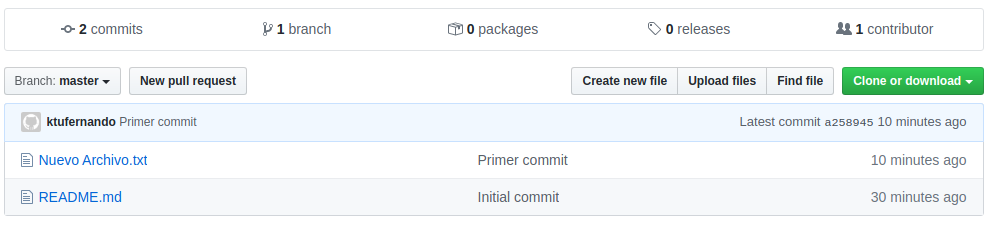

## ¿Nuevo en Git y Github?

GitHub es una interfaz de usuario / web como servicio de alojamiento de repositorios Git. Git es un sistema de control de versiones distribuido accesible a través de una línea de comando. Git es un software gratuito y de código abierto distribuido bajo los términos de la GNU General Public License versión 2.

Ahora que termine con la explicación aburrida, Git es increíble porque ayuda a realizar un seguimiento de los cambios en el código y permite la colaboración en proyectos de toda escala. Con Github, podemos compartir todos nuestros proyectos de desarrollo con el mundo. Github tiene una gran cantidad de características únicas que mejoran la experiencia de git y hacen que el desarrollo colaborativo sea simple. Cualquiera puede abrir mi página de Github, bifurcar, clonar un repositorio y jugar con el código. En este artículo vas a tener una breve guía para comenzar a usar Git en Github.

> Vas a tener que crearte una cuenta en Github y descargar e instalar Git en tu PC. Mi ejemplo es usando Linux pero podes hacerlo con Windows también.

#### Crear un nuevo Repo en Github:

Click en el botón verde “New” en la pestaña “Repositories”.

*Se muestra un formulario.*

1. Ingresá un nombre de repositorio.

2. Marcá el check “Initialize this repository with a README”.

3. Click en Crear repositorio.

*Luego se va a mostrar tu nuevo repositorio.*

> Nota: El repositorio se va a crear con un archivo dentro de él. Este archivo es el README.md. Este archivo es de tipo Markdown, un lenguaje de programación para documentar. En general todos los repositorios tienen o deberían tener un README en la base del repositorio, ya que Github toma este archivo para mostrar, de forma muy bonita, la descripción de tu proyecto.

4. Click en el botón verde “Clonar o descargar”.

5. Copia la dirección al portapapeles.

> Asegurate que la URL sea la que empieza con HTTPS. En este ejemplo vamos a usar HTTPS y no SSH, ya que para poder utilizar SSH es necesario configurar en tu cuenta de Github una clave pública. Si necesitas saber este método puedes escribirme para que haga otro artículo sobre ese tema.

*Una vez que hayas copiado la dirección del repositorio.*

1. Abrí una terminal. En Windows, hace click derecho en el escritorio y selecciona Git Bash. Se te va a abrir la terminal.

2. Escribí git clone <pega la dirección del repositorio copiada>.

*Aparecerá una carpeta que es una copia del repositorio clonado.*

Al clonar el repositorio, estamos creando una copia local del mismo. Ahora que tenemos un repositorio local, podemos agregar archivos y desarrollar en nuestro repositorio local, ¡y luego enviarlo a Github usando los comandos que te escribí más abajo como un cheat sheet!

***

#### Agrega un archivo a tu repositorio

Agregar un archivo al repositorio y pushear a Github es fácil.

1. Abrí la carpeta que se creó cuando clonaste tu repositorio.

2. Crea un nuevo archivo de texto.

3. En la terminal, asegurate de estar en el directorio correcto! Podés moverte a la carpeta creada con el comando “cd”.

4. Utilizá los siguientes comandos para enviar el archivo a Github. Este archivo se va a agregar a la rama master del repositorio:

>La rama master es la rama principal y se crea automáticamente cuando creas el repositorio.

    Trackea los archivos:
     $ git add .

    Commitea los archivos:
     $ git commit -m “tu comentario”

    Subi los archivos al repositorio remoto:
     $ git push -u origin master

Mirá en la página de Github el nuevo archivo que subiste!

#### Git Workflow Cheat Sheet

    --------------------------------------------
    Comandos comúnes de consola
    --------------------------------------------
    cd - cambiar de directorio
    mkdir - crear nuevo directorio
    ls - ver listado de archivos y carpetas en el directorio

    --------------------------------------------
    WORKFLOW
    --------------------------------------------
    Clonar el repositorio remoto en tu máquina local:
     $ git clone https://github.com/user_name/repo_name.git

    Asegurar que la rama master local está actualizada:
     $ git pull origin master

    Crear una nueva rama:
     $ git branch nombre_rama

    Moverse dentro de la nueva rama:
     $ git checkout nombre_rama

    Agregar archivos a la rama:
     $ git add .
    
    Verificar el estado de los archivos: 
     $ git status

    Commitear los archivos: 
     $ git commit -m “comentario”

    Subir rama y archivos al repositorio remoto: 
     $ git push -u origin nombre_rama

    # Podés ir a la pagina de Github para ver lo que subiste.

    --------------------------------------------
    Mergear la nueva rama a la rama master
    --------------------------------------------
    Volver a la rama master:
     $ git checkout master

    Mergear la nueva rama con la master local:
     $ git merge nombre_rama -m “comentario”

    Subir master local al master remoto:
     $ git push origin master

    Borrar la rama local:
     $ git branch -d nombre_rama
     O
     $ git branch -D nombre_rama

#### Mi Github

Si sos nuevo en Github y necesitas algunos repositorios para jugar, mira mi Github aquí: [https://github.com/ktufernando](https://github.com/ktufernando)

***

Antes de que te vayas…

¿Encontraste interesante el artículo? ¿Te gustaría que escriba sobre algún tema en particular?
Escribime o contactame a través de [Medium](https://medium.com/@ktufernando) o [GitHub](https://github.com/ktufernando) o [LinkedIn](https://www.linkedin.com/in/fervaldes/).