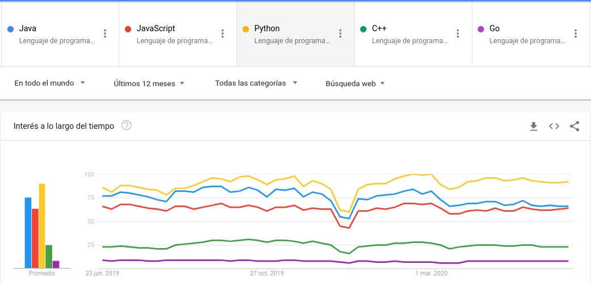
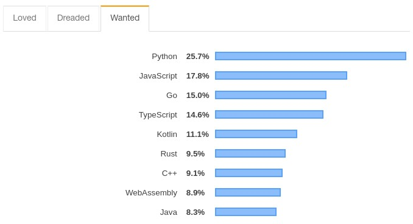
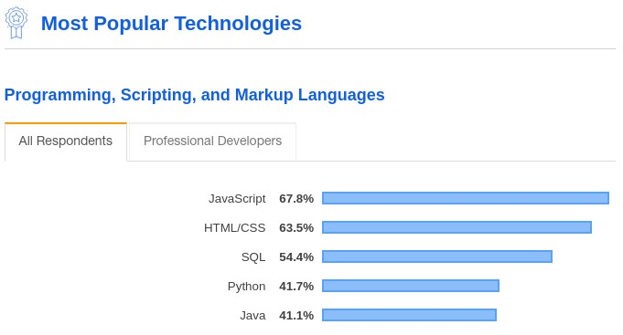
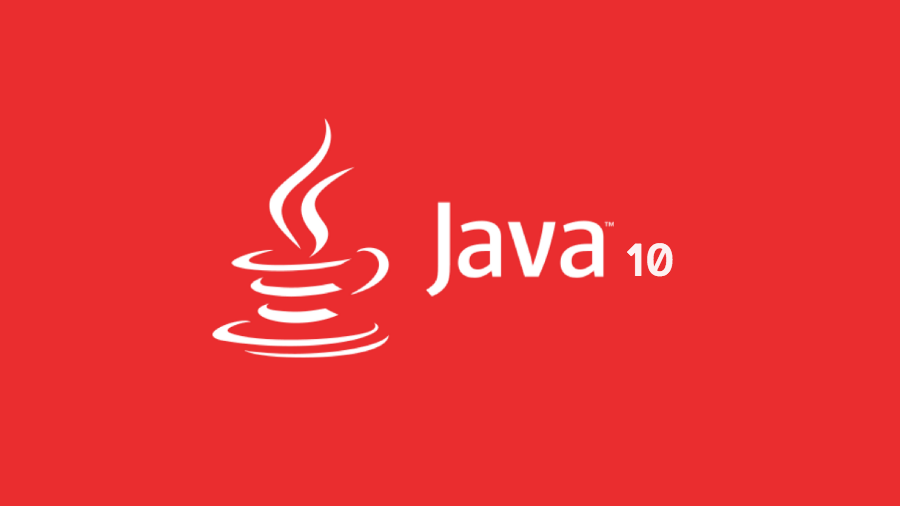

Es un buen momento para revisar los tres principales lenguajes de programación para aprender este año como desarrollador de software.

Desde que comencé a programar, use varios lenguajes de programación y la única constante fue el cambio.
Empecemos viendo esta imagen a continuación con las tendencias de Google para los principales lenguajes de programación que han estado en tendencia y serán la mejor opción para que aprendas o comiences en el 2020.

*https://trends.google.com/trends/explore?q=%2Fm%2F07sbkfb,%2Fm%2F02p97,%2Fm%2F05z1_,%2Fm%2F0jgqg,%2Fm%2F09gbxjr*

Python, JavaScript y Java han sido votados como los principales lenguajes de programación en varias encuestas y estudios. En este artículo, voy a analizar cada uno de estos lenguajes y aprenderemos sus características claves y cómo se diferencian entre sí.

***

### Python

Python es uno de los lenguajes de programación más populares de todos los tiempos. Es extremadamente simple de usar y ordenado.

> **El [sueldo promedio](https://www.indeed.com/career/python-developer/salaries) de un desarrollador Python en Estados Unidos es de $118,952 por año.**

En la [encuesta de Stackoverflow de 2019](https://insights.stackoverflow.com/survey/2019#most-loved-dreaded-and-wanted), Python se ubicaba como el lenguaje de programación más buscado del año por los desarrolladores. Esto no me sorprende porque Python es un lenguaje amigable para los desarrolladores.

Para aquellos de ustedes que comiencen con Python, van a notar que la sintaxis se ve muy diferente de los otros lenguajes de programación. No hay llaves, ni clases, ni modificadores públicos / privados. Es extremadamente simple y sin desorden. Esta es una de las razones por las que Python es tan atractivo para los desarrolladores.

#### ¿Por qué Python?

Un resumen rápido de por qué Python está clasificado como uno de los principales lenguajes de programación hoy en día.

  1. Fácil de usar.

  2. Libre de desorden en el código.

  3. Fácil de aprender para principiantes de programación.

  4. El más adecuado para machine learning, proyectos de IA e investigación.

  5. Sigue los paradigmas orientados a objetos.

  6. Se puede usar para construir aplicaciones frontend y backend.

  7. Ampliamente utilizado por los científicos de datos.

  8. Gran apoyo de la comunidad.

#### ¿Por qué no Python?

Python es muy amigable y popular para los desarrolladores, pero siempre hay algunos inconvenientes en cada lenguaje de programación. Algunas razones que considero de por qué Python puede no ser una buena opción.

  1. **No es adecuado para el desarrollo móvil:** Python apenas se usa para el desarrollo móvil, debido a la disponibilidad de otros marcos como React Native, Flutter y lenguajes nativos como Swift y Java. Por lo tanto, no vas a encontrar ninguna aplicación móvil codificada en Python.

  2. **Difícil de aprender otros lenguajes de programación:** si Python es el primer lenguaje que aprendés, podés terminar enamorándote de su simplicidad y, finalmente, se hace más difícil aprender otros lenguajes de programación. Otros lenguajes de programación como Java pueden parecer complejos al pasar de Python.

  3. **No se usa en el desarrollo de software a gran escala:** Python no se usa mucho en grandes empresas para el desarrollo de software empresarial. Los lenguajes como Java y JavaScript se usan con más frecuencia en comparación. Python es más lento en tiempo de ejecución y tiene limitaciones con el acceso a la base de datos. La capa de acceso a la base de datos de Python no es tan buena como JDBC u ODBC y no es adecuada para aplicaciones a gran escala.

***

### JavaScript

El siguiente lenguaje de programación para aprender en 2020, es uno de mis favoritos: JavaScript.

> **El [sueldo promedio](https://www.indeed.com/career/javascript-developer/salaries?from=top_sb) de los desarrolladores JavaScript en los Estados Unidos es de $ 118,313 por año.**

Por séptimo año consecutivo, JavaScript se ha clasificado como el lenguaje de programación más popular, en una encuesta realizada por StackOverflow.

#### ¿Por qué JavaScript?

Hay muchas razones por las que deberías aprender JavaScript en el año 2020:

  1. **Se utiliza en todas partes:** casi todas las aplicaciones frontend modernas de hoy en día están construidas con JavaScript. Si está trabajando en una aplicación frontend moderna, no hay forma de evitar o ignorar JavaScript.

  2. **Muchos frameworks modernos:** hoy en día, hay muchos frameworks y librerías de alta calidad que están escritos en JavaScript para el desarrollo frontend. Los frameworks/librerías React, Vue, Angular, React Native y muchos otros se usan ampliamente para crear aplicaciones frontend modernas.

  3. **Desarrollo amigable y facilidad de aprendizaje:** JavaScript es un lenguaje amigable para principiantes y los desarrolladores que se incorporan a JavaScript tienden a amarlo. Esto podría deberse a múltiples factores. El lenguaje en sí es atractivo para los desarrolladores y, además, la experiencia del desarrollador se ve mejorada con los ecosistemas modernos que están disponibles para apoyar el desarrollo.

  4. **Oportunidades laborales:** los desarrolladores de JavaScript tienen demanda en el mercado global. Una gran cantidad de compañías como Google, Facebook, Uber, etc., están fuertemente invertidas en el desarrollo de JavaScript, lo que brinda muchas oportunidades de trabajo en el mercado de JavaScript.

  5. **Desarrollo frontend y backend:** es interesante notar que aunque JavaScript está dominando la escena de desarrollo frontend, también se usa mucho para construir el backend usando frameworks como Node.js. Esto significa que, con JavaScript moderno, puede ser un desarrollador frontend y backend.

#### ¿Por qué no JavaScript?

  1. **Cambiando rápidamente:** JavaScript y sus frameworks están evolucionando rápidamente y el JavaScript actual es muy diferente de lo que era hace tres años. El cambio constante indica que hay mucho ímpetu y participación comunitaria en ello. Pero también podría ser intimidante mantenerse al día.

  2. **Preocupaciones de seguridad:** cuando hablamos de JavaScript se suele pensar o está más asociado al lado del cliente y el código generalmente está expuesto. Por lo tanto, esto podría llevar a algunas brechas de seguridad si no se utilizan las mejores prácticas durante el desarrollo.

***

### Java

El siguiente lenguaje de programación para aprender en 2020 es Java. Java es uno de los lenguajes de programación más utilizados que será un lenguaje perfecto para aprender en 2020.

> **El [sueldo promedio](https://www.indeed.com/career/java-developer/salaries?from=top_sb) de un desarrollador Java en Estados Unidos es de $ 104,321 por año.**

Java es ampliamente utilizado en aplicaciones de software a gran escala.

Los programas Java están más estructurados en comparación con lenguajes como Python y JavaScript. En Java todo debe estar dentro de una clase o una interfaz.

#### ¿Por qué Java?

Aquí hay un resumen rápido de por qué debería aprender Java:

  1. **Java se usa en aplicaciones de software empresarial:** una de las principales razones para aprender Java es que se usa en muchas empresas tecnológicas de todo el mundo para crear aplicaciones a gran escala. Las principales compañías como Uber, AirBnb, Twitter y muchas otras usan Java en su stack tecnológico. Esto significa que encontrar un trabajo como desarrollador de Java es relativamente fácil.

  2. **Rendimiento:** las aplicaciones escritas en Java están optimizadas para el rendimiento y son más rápidas que los lenguajes escritos dinámicamente. Las JVM están modernizadas y tienen un rendimiento óptimo, lo que las hace ideales para aplicaciones grandes.

  3. **Desarrollo de Android:** Java se usa para desarrollar aplicaciones nativas de Android. Si estás interesado en convertirte en un desarrollador móvil centrado en la creación de aplicaciones nativas de Android, entonces aprender Java tiene mucho sentido.

  4. **Comunidad enorme:** Java ha sido un lenguaje de programación popular durante más de una década, y existe un gran apoyo de la comunidad. Cuando comiences a aprender Java, encontrarás toneladas de recursos, foros y libros para ayudarte con tu aprendizaje.

  5. **Plataforma y herramientas:** el ecosistema de Java ha evolucionado a lo largo de los años, y hay varias herramientas e IDE geniales que admiten el desarrollo en Java como IntelliJ, Eclipse, etc.

#### ¿Por qué no Java?
  
  1. **Código detallado:** el código Java es extremadamente detallado y tiende a confundir a un programador principiante. Esto significa que el código viene con una gran cantidad de repetitivos, lo que podría ser frustrante para algunos desarrolladores.

  2. **Lenguaje antiguo:** los desarrolladores y startups de la nueva era tienden a elegir otras alternativas a Java. Esto se debe a que es más antiguo y prefieren explorar un lenguaje de programación más nuevo y vanguardista. Si planeas trabajar para nuevas empresas y tecnologías de punta, entonces puede que quieras considerar aprender un lenguaje de programación diferente que sea más adecuado.

***

Este articulo es solo una opinión personal, de todas maneras espero que pueda ayudarte a formar tu camino en la vida de un profesional del software.
Si te gusto este articulo, me ayudas y ayudas a los demás compartiéndolo con otras personas.

***

Muchas cosas de las que leíste en este artículo ya las sabés. La mayoría de este conocimiento que te compartí ya lo sabés. Sabemos lo que tenemos que hacer, sabemos lo que tenemos que evitar, todo esto ya lo sabemos. El único problema es que no lo ponemos en práctica, por esto es que necesito que te comprometas conmigo, en que si una de las ideas que mencioné resuena en vos, te interesa ponerla en práctica, que te comprometas a que vas a empezar hoy mismo con el paso más pequeño posible, el gesto más mínimo a hacerlo.
Solo pensar en poner en práctica no sirve, tenés que ponerte en práctica para tu crecimiento exponencial.

***

Antes de que te vayas…

¿Encontraste interesante el artículo? ¿Te gustaría que escriba sobre algún tema en particular?
Escribime o contactame a través de [Medium](https://medium.com/@ktufernando) o [GitHub](https://github.com/ktufernando) o [LinkedIn](https://www.linkedin.com/in/fervaldes/).